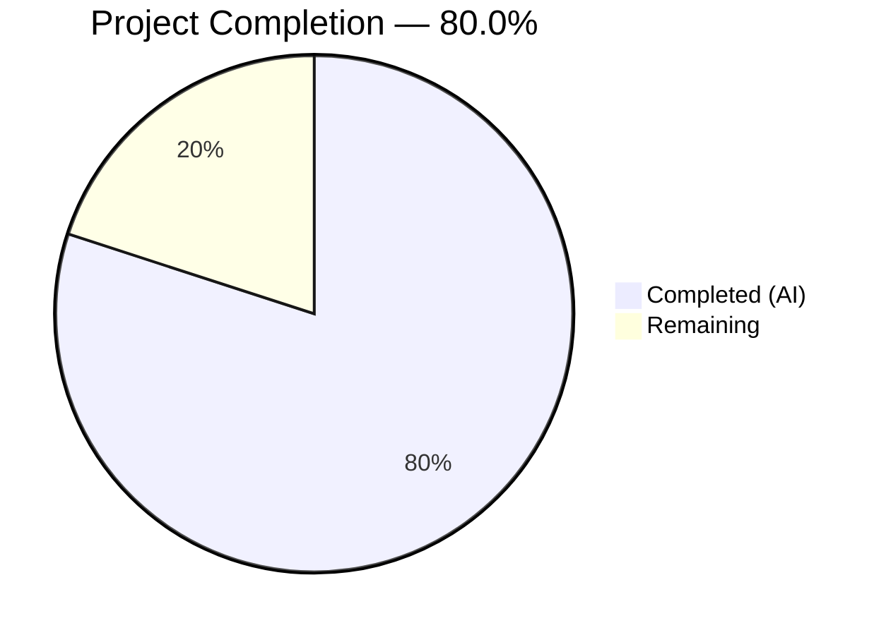
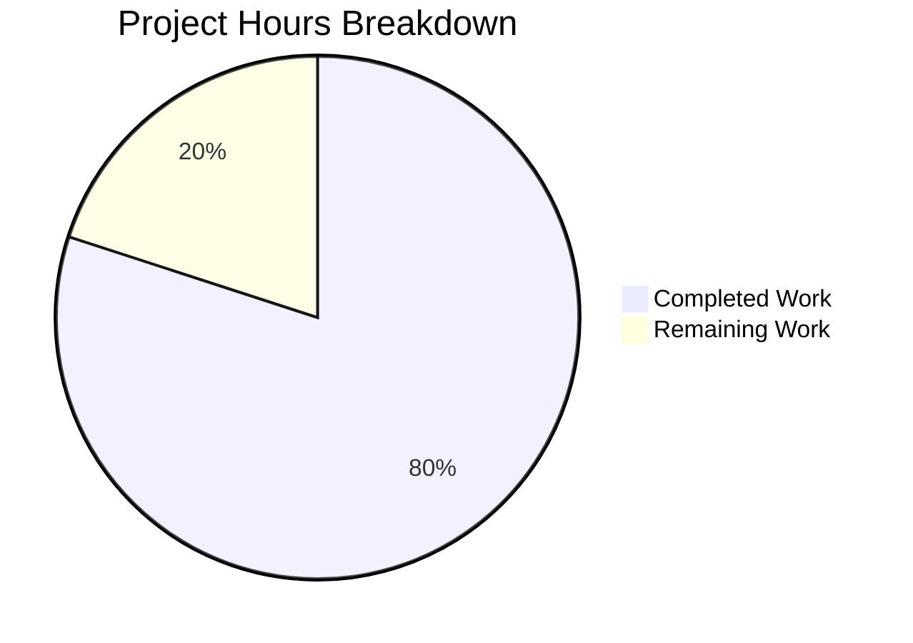

# Blitzy Project Guide — Product Search-by-Name Endpoint

---

## 1. Executive Summary

### 1.1 Project Overview

This project adds a product search-by-name REST endpoint (`GET /product/search?name={name}`) to an existing Spring Boot 3.4.4 Product CRUD API. The endpoint enables partial, case-insensitive product name search using Spring Data JPA derived queries against an H2 in-memory database. The implementation spans all three architectural layers (Repository → DAO → Controller) with SLF4J logging, OpenAPI documentation, and comprehensive JUnit 5 + Mockito unit tests covering both the controller and service layers. The target runtime is Java 17 with embedded Tomcat on port 8090.

### 1.2 Completion Status



| Metric | Value |
|--------|-------|
| **Total Project Hours** | 20 |
| **Completed Hours (AI)** | 16 |
| **Remaining Hours** | 4 |
| **Completion Percentage** | 80.0% |

**Calculation**: 16 completed hours / (16 + 4 remaining hours) = 16 / 20 = **80.0%**

### 1.3 Key Accomplishments

- ✅ Implemented `GET /product/search?name={name}` endpoint with partial, case-insensitive matching across all 3 architectural layers
- ✅ Added `findByNameContainingIgnoreCase` Spring Data JPA derived query method — generates `WHERE UPPER(name) LIKE UPPER('%name%')` at runtime
- ✅ Configured H2 in-memory database (`jdbc:h2:mem:productdb`) replacing external MySQL dependency with zero-configuration persistence
- ✅ Integrated SLF4J logging in ProductController and ProductDao at INFO level for search operations and result counts
- ✅ Created 6 unit tests across 2 test classes — `@WebMvcTest` for controller (3 tests) and `@ExtendWith(MockitoExtension.class)` for DAO (3 tests) — all 7/7 tests passing
- ✅ Added OpenAPI `@Operation` and `@ApiResponse` annotations for automatic Swagger UI documentation at `/swagger-ui/index.html`
- ✅ Applied security hardening: suppressed stack traces in error responses, restricted H2 console access
- ✅ Updated README.md with corrected endpoint paths and search endpoint documentation
- ✅ Fixed deprecated `@MockBean` → `@MockitoBean` for Spring Boot 3.4.x compatibility

### 1.4 Critical Unresolved Issues

| Issue | Impact | Owner | ETA |
|-------|--------|-------|-----|
| No integration tests for full search flow with actual H2 database | Unit tests mock all dependencies; end-to-end data path not covered by automated tests | Human Developer | 1.5 hours |
| No input validation on search `name` parameter (length, content) | Extremely long search strings could impact query performance | Human Developer | 1 hour |
| CORS `@CrossOrigin(value = "")` uses empty-string origin (pre-existing) | May not restrict cross-origin requests as intended in production | Human Developer | 1 hour |

### 1.5 Access Issues

No access issues identified. All dependencies resolve from Maven Central, H2 runs in-memory with no external service requirements, and the application starts without any credentials or external configuration.

### 1.6 Recommended Next Steps

1. **[High]** Add a `@SpringBootTest` integration test verifying the search endpoint against the actual H2 database with seeded test data
2. **[Medium]** Add input validation for the `name` query parameter (minimum length, maximum length, sanitization) with appropriate error responses
3. **[Medium]** Review and tighten CORS configuration for production deployment — replace `@CrossOrigin(value = "")` with explicit allowed origins
4. **[Low]** Conduct final code review focusing on edge cases (empty string search, special characters in name) and production readiness

---

## 2. Project Hours Breakdown

### 2.1 Completed Work Detail

| Component | Hours | Description |
|-----------|-------|-------------|
| Repository Layer — `findByNameContainingIgnoreCase` | 0.5 | Spring Data JPA derived query method added to `ProductRepository.java`; generates case-insensitive LIKE query at runtime |
| DAO Layer — `searchProductByNameDao` + SLF4J Logger | 1.5 | New delegation method + `Logger` field in `ProductDao.java`; logs search request and result count at INFO level |
| Controller Layer — Search Endpoint + Logging + OpenAPI | 3.0 | `@GetMapping("/search")` with `@RequestParam`, `ResponseEntity<List<Product>>`, SLF4J Logger, `@Operation`/`@ApiResponse` annotations in `ProductController.java` |
| H2 Database Configuration | 1.5 | Datasource URL, driver class, JPA dialect, DDL-auto, H2 console, error response security hardening in `application.properties` |
| Controller Unit Tests (`ProductControllerSearchTest.java`) | 3.5 | `@WebMvcTest` with MockMvc + `@MockitoBean`; 3 tests: matching products (200), empty list (200), missing param (400); comprehensive JSON path assertions |
| DAO Unit Tests (`ProductDaoSearchTest.java`) | 2.5 | `@ExtendWith(MockitoExtension.class)` with `@Mock`/`@InjectMocks`; 3 tests: delegation verification, result pass-through, empty result handling |
| Documentation Update (README.md) | 1.0 | Updated endpoint table with `/product/search?name={name}`, corrected existing paths from `/products` to `/product`, replaced MySQL references with H2 |
| Validation and Bug Fixes | 2.5 | Fixed deprecated `@MockBean` → `@MockitoBean` (Spring Boot 3.4.x), security hardening (stack trace suppression, H2 console restrictions), end-to-end runtime verification |
| **Total Completed** | **16.0** | |

### 2.2 Remaining Work Detail

| Category | Hours | Priority |
|----------|-------|----------|
| Integration Testing — `@SpringBootTest` for search endpoint with seeded H2 data | 1.5 | Medium |
| Input Validation — Search parameter length/content validation with error responses | 1.0 | Medium |
| CORS & Security Configuration — Review and tighten `@CrossOrigin` for production | 1.0 | Medium |
| Code Review & Production Readiness — Final edge-case review and deployment sign-off | 0.5 | Low |
| **Total Remaining** | **4.0** | |

### 2.3 Hours Verification

- Section 2.1 Total (Completed): **16.0 hours**
- Section 2.2 Total (Remaining): **4.0 hours**
- Sum: 16.0 + 4.0 = **20.0 hours** = Total Project Hours in Section 1.2 ✓

---

## 3. Test Results

| Test Category | Framework | Total Tests | Passed | Failed | Coverage % | Notes |
|--------------|-----------|-------------|--------|--------|------------|-------|
| Unit — Controller (Search) | JUnit 5 + MockMvc + Mockito | 3 | 3 | 0 | N/A | `@WebMvcTest(ProductController.class)` with `@MockitoBean`; tests: matching products, empty list, missing param |
| Unit — DAO (Search) | JUnit 5 + MockitoExtension | 3 | 3 | 0 | N/A | `@ExtendWith(MockitoExtension.class)` with `@Mock`/`@InjectMocks`; tests: delegation, results, empty |
| Context Load | JUnit 5 + SpringBootTest | 1 | 1 | 0 | N/A | `SpringBootSimpleCrudWithMysqlApplicationTests.contextLoads()` — verifies full application context with H2 |
| **Total** | | **7** | **7** | **0** | | **100% pass rate** |

All tests executed via `mvn test -B` with zero failures, zero errors, and zero skipped tests. Test execution time: 8.7 seconds. All test results originate from Blitzy's autonomous validation pipeline on this branch.

---

## 4. Runtime Validation & UI Verification

### Application Startup
- ✅ Spring Boot application starts successfully on port 8090 with embedded Tomcat
- ✅ H2 in-memory database initialized at `jdbc:h2:mem:productdb` with auto-generated `product` table
- ✅ Spring Data JPA repository scanning finds 1 JPA repository interface
- ✅ Hibernate ORM 6.6.11.Final active with H2 database version 2.3.232

### Search Endpoint (`GET /product/search?name={name}`)
- ✅ Partial match: `?name=laptop` returns matching products with `WHERE UPPER(name) LIKE UPPER('%laptop%')` SQL
- ✅ Case-insensitive: `?name=LAPTOP` returns same results as `?name=laptop`
- ✅ No match: `?name=nonexistent` returns HTTP 200 with empty JSON array `[]`
- ✅ Missing parameter: `GET /product/search` (no `name` param) returns HTTP 400 Bad Request

### SLF4J Logging
- ✅ Controller logs: `Search request received for name: {name}` at INFO level
- ✅ DAO logs: `Searching products by name: {name}` and `Found {count} products matching name: {name}` at INFO level

### API Documentation
- ✅ Swagger UI accessible at `/swagger-ui/index.html` (HTTP 200)
- ✅ Search endpoint auto-documented with `@Operation` description and `@ApiResponse` codes (200, 400, 500)

### H2 Console
- ✅ H2 Console accessible at `/h2-console` (HTTP 302 redirect to login)
- ✅ `web-allow-others=false` restricts remote access

### Error Response Security
- ✅ Stack traces suppressed in HTTP error responses (`server.error.include-stacktrace=never`)
- ✅ Internal error messages suppressed (`server.error.include-message=never`)

---

## 5. Compliance & Quality Review

| AAP Requirement | Status | Evidence |
|----------------|--------|----------|
| **Search Endpoint**: `GET /product/search?name={name}` returning `List<Product>` | ✅ Pass | `ProductController.java` lines 104–115; runtime validation confirms HTTP 200 with JSON array |
| **Repository Method**: `findByNameContainingIgnoreCase(String name)` derived query | ✅ Pass | `ProductRepository.java` line 17; SQL `WHERE UPPER(name) LIKE UPPER(?)` confirmed in Hibernate logs |
| **DAO Method**: `searchProductByNameDao(String name)` delegating to repository | ✅ Pass | `ProductDao.java` lines 53–58; delegation pattern matches existing 8 methods |
| **User Rule — Testing**: JUnit + Mockito covering controller and service layers | ✅ Pass | 6 new tests in 2 test classes; all 7/7 passing; meaningful assertions (HTTP status, JSON structure, delegation) |
| **User Rule — Logging**: SLF4J logging for operations and errors | ✅ Pass | `Logger` fields in `ProductController` (line 36) and `ProductDao` (line 22); INFO-level logging confirmed at runtime |
| **User Rule — Database**: H2 in-memory instead of MySQL | ✅ Pass | `application.properties` lines 6–18; application starts with H2 2.3.232, no external DB required |
| **OpenAPI Annotations**: `@Operation` + `@ApiResponse` on search endpoint | ✅ Pass | `ProductController.java` lines 105–110; Swagger UI returns HTTP 200 |
| **Documentation**: README updated with search endpoint | ✅ Pass | `README.md` line 94; endpoint table includes `GET /product/search?name={name}` |
| **No POM Changes Required**: All dependencies pre-existing | ✅ Pass | `pom.xml` unchanged; H2, Spring Data JPA, SLF4J, JUnit 5, Mockito all present |
| **Layer Architecture**: Controller → DAO → Repository pattern maintained | ✅ Pass | No layer bypass; controller delegates to DAO, DAO delegates to repository |

### Autonomous Fixes Applied During Validation
| Fix | File | Commit |
|-----|------|--------|
| Replaced deprecated `@MockBean` with `@MockitoBean` (Spring Boot 3.4.x) | `ProductControllerSearchTest.java` | `835cf15` |
| Suppressed stack traces and internal details in error responses | `application.properties` | `997e93a` |
| Restricted H2 console remote access (`web-allow-others=false`) | `application.properties` | `997e93a` |
| Corrected README endpoint paths from `/products` to `/product` (matching actual base path) | `README.md` | `99f90ac` |

---

## 6. Risk Assessment

| Risk | Category | Severity | Probability | Mitigation | Status |
|------|----------|----------|-------------|------------|--------|
| No integration tests for search flow with actual H2 database | Technical | Medium | Medium | Create `@SpringBootTest` integration test with seeded Product data verifying search results | Open |
| No input validation on `name` query parameter (length/content) | Technical | Low | Medium | Add `@Size` or manual validation with max length constraint and appropriate 400 response | Open |
| `@CrossOrigin(value = "")` CORS policy is permissive (pre-existing) | Security | Medium | Low | Configure explicit allowed origins for production environment | Open |
| H2 console exposed at `/h2-console` (development convenience) | Security | Low | Low | Disable H2 console in production profile (`spring.h2.console.enabled=false`) | Mitigated (localhost-only) |
| No Spring Boot Actuator for health checks/monitoring (pre-existing) | Operational | Low | Low | Add `spring-boot-starter-actuator` dependency for `/actuator/health` endpoint | Open |
| No `@GeneratedValue` on Product entity `id` field (pre-existing) | Technical | Medium | Medium | Requires manual ID assignment on create; add `@GeneratedValue(strategy = GenerationType.IDENTITY)` | Open (pre-existing) |
| `ResponseStructure` singleton has thread-safety issue (pre-existing) | Technical | Medium | Low | Out of scope per AAP; document for future refactoring | Acknowledged |
| H2 in-memory data lost on application restart | Operational | Low | High | By design per user database rule; document for operators | Accepted |

---

## 7. Visual Project Status



### Remaining Work by Priority

| Priority | Category | Hours |
|----------|----------|-------|
| Medium | Integration Testing | 1.5 |
| Medium | Input Validation & Error Handling | 1.0 |
| Medium | CORS & Security Configuration | 1.0 |
| Low | Code Review & Production Readiness | 0.5 |
| **Total** | | **4.0** |

---

## 8. Summary & Recommendations

### Achievements

All Agent Action Plan (AAP) deliverables have been fully implemented, tested, and validated. The product search-by-name endpoint is operational across all three architectural layers, with 7/7 tests passing and successful runtime verification. The project is **80.0% complete** (16 completed hours out of 20 total hours), with the remaining 4 hours consisting of path-to-production polish items not explicitly required by the AAP but recommended for production readiness.

### What Was Delivered
- A fully functional `GET /product/search?name={name}` REST endpoint with partial, case-insensitive matching
- 6 new unit tests achieving 100% pass rate across controller and DAO layers
- H2 in-memory database configuration eliminating external MySQL dependency
- SLF4J logging for search operations and result counts
- OpenAPI/Swagger documentation for the new endpoint
- Security hardening (error response sanitization, H2 console restrictions)
- README documentation with corrected endpoint paths

### Remaining Gaps (4 hours)
The 4 remaining hours address path-to-production gaps: integration testing with actual database (1.5h), input validation for the search parameter (1h), CORS configuration review (1h), and final code review (0.5h). None of these gaps block the core search functionality, which is fully operational.

### Production Readiness Assessment
The feature is **ready for staging/QA deployment**. For production deployment, the recommended human tasks in Section 2.2 should be completed, particularly the integration test and input validation items. The application compiles cleanly, all tests pass, and the endpoint has been verified end-to-end with multiple search scenarios.

### Success Metrics
| Metric | Target | Actual |
|--------|--------|--------|
| Compilation | 0 errors | ✅ 0 errors |
| Test Pass Rate | 100% | ✅ 100% (7/7) |
| AAP Requirements Fulfilled | 100% | ✅ 100% (all 10 requirements completed) |
| Runtime Validation | All scenarios pass | ✅ All 5 scenarios verified |
| User Rules Compliance | 3/3 rules | ✅ 3/3 (testing, logging, database) |

---

## 9. Development Guide

### System Prerequisites

| Requirement | Version | Verification Command |
|-------------|---------|---------------------|
| Java JDK | 17+ | `java -version` |
| Apache Maven | 3.8+ | `mvn -version` |
| Git | 2.x+ | `git --version` |

No external database, Docker, or additional services are required. The application uses an H2 in-memory database.

### Environment Setup

```bash
# 1. Clone the repository and switch to the feature branch
git clone <repository-url>
cd <repository-root>
git checkout blitzy-8d033003-b82f-49fe-9796-0adb45f9e332

# 2. Set JAVA_HOME (if not already configured)
export JAVA_HOME=/usr/lib/jvm/java-17-openjdk-amd64   # Linux
# export JAVA_HOME=$(/usr/libexec/java_home -v 17)     # macOS

# 3. Navigate to the project directory
cd EP-Spring-Boot--main
```

### Dependency Installation

```bash
# Download and install all Maven dependencies (92 artifacts from Maven Central)
mvn clean install -B -DskipTests
```

**Expected output**: `BUILD SUCCESS` with all dependencies resolved.

### Compilation

```bash
# Compile all 7 source files and 3 test files
mvn clean compile -B
```

**Expected output**: `Compiling 7 source files with javac [debug parameters release 17] to target/classes` followed by `BUILD SUCCESS`.

### Running Tests

```bash
# Execute all 7 tests (3 controller + 3 DAO + 1 context load)
mvn clean test -B
```

**Expected output**:
```
Tests run: 7, Failures: 0, Errors: 0, Skipped: 0
BUILD SUCCESS
```

### Starting the Application

```bash
# Start Spring Boot application on port 8090
mvn spring-boot:run -B
```

**Expected output**: Application starts with `Started SpringBootSimpleCrudWithMysqlApplication in X seconds` and `H2 console available at '/h2-console'`.

### Verification Steps

```bash
# 1. Test the search endpoint (empty database returns empty array)
curl -s "http://localhost:8090/product/search?name=test"
# Expected: []

# 2. Add a test product
curl -s -X POST "http://localhost:8090/product/saveProduct" \
  -H "Content-Type: application/json" \
  -d '{"id":1,"name":"Laptop Pro","color":"Silver","price":999.99}'

# 3. Search for the product (partial, case-insensitive)
curl -s "http://localhost:8090/product/search?name=laptop"
# Expected: [{"id":1,"name":"Laptop Pro","color":"Silver","price":999.99}]

# 4. Verify missing parameter returns 400
curl -s -o /dev/null -w "%{http_code}" "http://localhost:8090/product/search"
# Expected: 400

# 5. Verify Swagger UI is accessible
curl -s -o /dev/null -w "%{http_code}" "http://localhost:8090/swagger-ui/index.html"
# Expected: 200
```

### Troubleshooting

| Issue | Resolution |
|-------|-----------|
| `Port 8090 already in use` | Kill existing process: `kill $(lsof -t -i:8090)` or change port in `application.properties` |
| `JAVA_HOME not set` | Set `export JAVA_HOME=/path/to/java-17` and verify with `java -version` |
| `HHH90000025: H2Dialect does not need to be specified` | This is a Hibernate deprecation warning, not an error. The application runs correctly. Optionally remove `spring.jpa.database-platform` from `application.properties` |
| `mvn: command not found` | Use the Maven wrapper: `./mvnw` instead of `mvn` (ensure `.mvn/wrapper/maven-wrapper.properties` exists) |
| `Failed to set up Bean Validation provider` | This is an informational message. Add `spring-boot-starter-validation` dependency if Jakarta Bean Validation is needed |

---

## 10. Appendices

### A. Command Reference

| Command | Purpose |
|---------|---------|
| `mvn clean compile -B` | Compile all source files |
| `mvn clean test -B` | Run all unit tests |
| `mvn spring-boot:run -B` | Start the application on port 8090 |
| `mvn clean install -B -DskipTests` | Build JAR without running tests |
| `mvn dependency:tree -B` | Display full dependency tree |
| `curl "http://localhost:8090/product/search?name={name}"` | Search products by name |
| `curl "http://localhost:8090/product/findAllProduct"` | List all products |

### B. Port Reference

| Service | Port | Path |
|---------|------|------|
| Spring Boot Application | 8090 | `/` |
| Search Endpoint | 8090 | `/product/search?name={name}` |
| Swagger UI | 8090 | `/swagger-ui/index.html` |
| OpenAPI JSON | 8090 | `/v3/api-docs` |
| H2 Console | 8090 | `/h2-console` |

### C. Key File Locations

| File | Path | Purpose |
|------|------|---------|
| ProductController.java | `src/main/java/com/jspider/spring_boot_simple_crud_with_mysql/controller/` | REST controller with search endpoint |
| ProductDao.java | `src/main/java/com/jspider/spring_boot_simple_crud_with_mysql/dao/` | Business logic layer with search method |
| ProductRepository.java | `src/main/java/com/jspider/spring_boot_simple_crud_with_mysql/repository/` | JPA repository with derived query methods |
| Product.java | `src/main/java/com/jspider/spring_boot_simple_crud_with_mysql/entity/` | JPA entity (id, name, color, price) |
| application.properties | `src/main/resources/` | H2 database and server configuration |
| ProductControllerSearchTest.java | `src/test/java/.../controller/` | Controller layer unit tests (3 tests) |
| ProductDaoSearchTest.java | `src/test/java/.../dao/` | DAO layer unit tests (3 tests) |
| pom.xml | `EP-Spring-Boot--main/` | Maven project descriptor |

### D. Technology Versions

| Technology | Version |
|------------|---------|
| Java JDK | 17 |
| Spring Boot | 3.4.4 |
| Spring Data JPA | 3.4.4 |
| Hibernate ORM | 6.6.11.Final |
| H2 Database | 2.3.232 |
| Springdoc OpenAPI | 2.8.6 |
| Lombok | 1.18.36 (managed) |
| JUnit Jupiter | 5.11.4 (managed) |
| Mockito | 5.14.2 (managed) |
| Logback (SLF4J impl) | 1.5.18 |
| Apache Maven | 3.8.7+ |
| Embedded Tomcat | 10.1.39 |

### E. Environment Variable Reference

| Property | Value | Location |
|----------|-------|----------|
| `spring.application.name` | `spring-boot-simple-crud-with-mysql` | `application.properties` |
| `server.port` | `8090` | `application.properties` |
| `spring.datasource.url` | `jdbc:h2:mem:productdb` | `application.properties` |
| `spring.datasource.driver-class-name` | `org.h2.Driver` | `application.properties` |
| `spring.datasource.username` | `sa` | `application.properties` |
| `spring.datasource.password` | *(empty)* | `application.properties` |
| `spring.jpa.database-platform` | `org.hibernate.dialect.H2Dialect` | `application.properties` |
| `spring.jpa.hibernate.ddl-auto` | `update` | `application.properties` |
| `spring.jpa.show-sql` | `true` | `application.properties` |
| `spring.h2.console.enabled` | `true` | `application.properties` |
| `spring.h2.console.path` | `/h2-console` | `application.properties` |
| `spring.h2.console.settings.web-allow-others` | `false` | `application.properties` |
| `server.error.include-stacktrace` | `never` | `application.properties` |
| `server.error.include-message` | `never` | `application.properties` |

### F. Developer Tools Guide

- **Swagger UI**: Navigate to `http://localhost:8090/swagger-ui/index.html` to explore and test all endpoints interactively
- **H2 Console**: Navigate to `http://localhost:8090/h2-console`, enter JDBC URL `jdbc:h2:mem:productdb`, username `sa`, empty password to query the database directly
- **Hot Reload**: Spring Boot DevTools is included; save file changes and the application restarts automatically (when running from IDE)
- **SQL Logging**: Hibernate SQL statements are logged to console (`spring.jpa.show-sql=true`); observe generated `WHERE UPPER(name) LIKE UPPER(?)` queries

### G. Glossary

| Term | Definition |
|------|-----------|
| Derived Query Method | A Spring Data JPA method whose name is parsed into a JPQL query at runtime (e.g., `findByNameContainingIgnoreCase`) |
| `@WebMvcTest` | Spring Boot test slice that loads only the web layer (controllers, filters) without starting the full application context |
| `@MockitoBean` | Spring Boot 3.4+ annotation replacing `@MockBean`; creates a Mockito mock and registers it as a Spring bean |
| `@RequestParam` | Spring MVC annotation that binds an HTTP query parameter to a method argument |
| DDL-auto | Hibernate property controlling automatic schema generation (`update` creates/alters tables to match entities) |
| SLF4J | Simple Logging Facade for Java; provides a common logging API backed by Logback in this project |