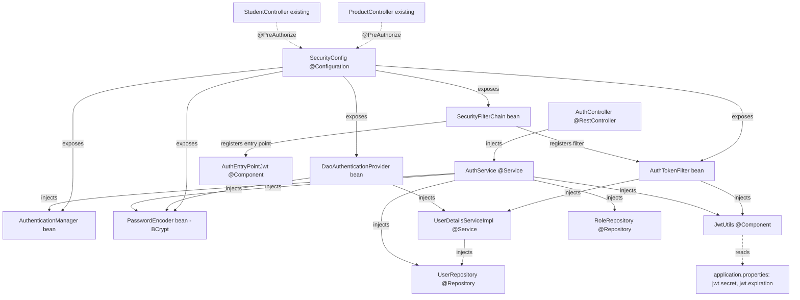
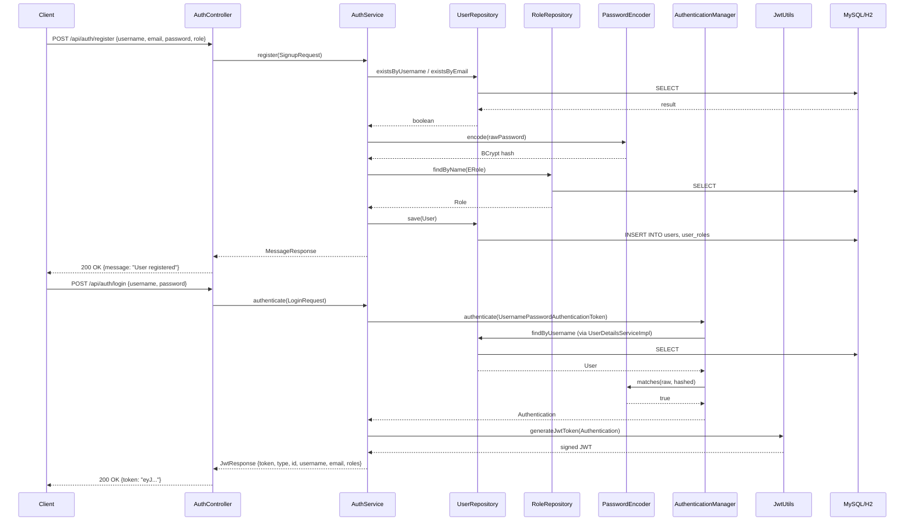
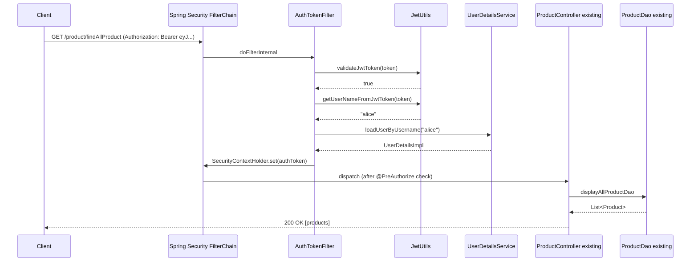

# Technical Specification

# 0. Agent Action Plan

## 0.1 Intent Clarification

### 0.1.1 Core Feature Objective

Based on the prompt, the Blitzy platform understands that the new feature requirement is to add a complete JWT-based authentication and authorization layer to the existing `spring-boot-simple-crud-with-mysql` Spring Boot 3.4.4 REST API project, integrating Spring Security as the security framework and securing all existing endpoints (the ten `/product/*` endpoints in `ProductController` and the two `/student/*` endpoints in `StudentController`) while exposing two new public endpoints for user registration and login. The feature transforms the system from its current "deliberately absent" security posture (per §6.4.1 of the specification) into a stateless, token-authenticated REST service with role-based access control.

The user-stated requirements decompose into the following technical objectives, each of which the Blitzy platform interprets with full technical precision:

- **Spring Boot version**: Use the latest stable Spring Boot release. The Blitzy platform interprets this as upgrading the existing parent POM from `org.springframework.boot:spring-boot-starter-parent:3.4.4` to **`3.5.14`**, the most recent stable release in the Spring Boot 3.x line as of April 2026, which is fully compatible with the existing Java 17 baseline, the existing `springdoc-openapi-starter-webmvc-ui:2.8.6` dependency, and Spring Security 6.5.x (BOM-managed by Spring Boot 3.5.x). The 3.x line is selected over the 4.0.x line because the existing codebase is anchored on 3.4.4, a minor version upgrade preserves binary and source compatibility for all existing components (`ProductController`, `ProductDao`, `ProductRepository`, `Product` entity, `ResponseStructure`), and Spring Boot 3.5.x is a fully-supported stable line (per the official endoflife.date listing).

- **JWT-based authentication**: Implement JSON Web Token issuance, signing, and validation using the JJWT library (`io.jsonwebtoken:jjwt-api`, `jjwt-impl`, `jjwt-jackson` at version **0.13.0**, the latest stable as of October 2025). The implementation must produce signed JWTs containing the username (as `sub`), the user's roles (as a custom claim), the issued-at timestamp (`iat`), and the expiration timestamp (`exp`), using HMAC-SHA-256 (HS256) symmetric signing keyed off a secret loaded from `application.properties`.

- **Spring Security integration**: Add `org.springframework.boot:spring-boot-starter-security` (version managed by the Spring Boot 3.5.14 BOM, which resolves to Spring Security 6.5.x) and configure a `SecurityFilterChain` bean that establishes stateless session management, registers a custom `OncePerRequestFilter` for JWT validation, and applies role-based authorization rules to all existing endpoints.

- **Domain model components**: Create a `User` JPA entity with the fields `id` (auto-generated `Long`), `username` (unique, non-null), `email` (unique, non-null), `password` (BCrypt-hashed, non-null), and a many-to-many relationship to a `Role` entity. Create a `Role` JPA entity with `id` (auto-generated `Long`) and `name` (an `ERole` enum constrained to the values `ROLE_USER` and `ROLE_ADMIN`). Both entities live under a new `com.jspider.spring_boot_simple_crud_with_mysql.entity` namespace alongside the existing `Product` entity.

- **Persistence layer**: Create two Spring Data JPA repositories — `UserRepository extends JpaRepository<User, Long>` (with derived query methods `findByUsername`, `existsByUsername`, `existsByEmail`) and `RoleRepository extends JpaRepository<Role, Long>` (with `findByName(ERole name)`) — under a new `com.jspider.spring_boot_simple_crud_with_mysql.repository` namespace alongside the existing `ProductRepository`.

- **Service layer**: Implement two services — a `UserDetailsServiceImpl implements UserDetailsService` that loads a user by username and adapts the `User` entity to a Spring Security `UserDetails` object, and an `AuthService` that orchestrates registration (password hashing, role assignment, persistence) and login (credential validation via `AuthenticationManager`, JWT issuance).

- **JWT utility**: Create a `JwtUtils` component that exposes `generateJwtToken(Authentication)`, `validateJwtToken(String)`, and `getUserNameFromJwtToken(String)` methods, encapsulating all JJWT API interactions, secret-key handling, and exception translation.

- **Security configuration class**: Create a `SecurityConfig` class annotated with `@Configuration`, `@EnableWebSecurity`, and `@EnableMethodSecurity(prePostEnabled = true)`, exposing a `SecurityFilterChain` bean that wires the JWT filter, disables CSRF (acceptable for stateless REST APIs), enforces stateless session creation policy, and declares the authorization rules.

- **Authentication filter**: Create an `AuthTokenFilter extends OncePerRequestFilter` that intercepts every HTTP request, extracts the `Authorization: Bearer <token>` header, validates the token via `JwtUtils`, loads the authenticated principal via `UserDetailsServiceImpl`, and populates `SecurityContextHolder` with a fully-authenticated `UsernamePasswordAuthenticationToken`. The filter must be registered before Spring Security's `UsernamePasswordAuthenticationFilter` in the chain.

- **Password encryption**: Configure a `BCryptPasswordEncoder` bean (with the framework default strength of 10) inside `SecurityConfig`, and wire it into `AuthService` for registration-time hashing and into `DaoAuthenticationProvider` for login-time verification.

- **Authentication endpoints**: Create an `AuthController` mapped under `/api/auth` exposing two endpoints: `POST /api/auth/register` (accepts a `SignupRequest` DTO containing `username`, `email`, `password`, and an optional `Set<String> role`; returns a `MessageResponse` DTO) and `POST /api/auth/login` (accepts a `LoginRequest` DTO containing `username` and `password`; returns a `JwtResponse` DTO containing `token`, `type` set to `"Bearer"`, `id`, `username`, `email`, and `roles`).

- **Endpoint security policy**: Configure the `SecurityFilterChain` such that all paths matching `/api/auth/**` are publicly accessible (`permitAll()`), while every other path — including all existing `/product/*` and `/student/*` endpoints, the OpenAPI documentation paths `/v3/api-docs/**`, and the Swagger UI paths `/swagger-ui/**` — is annotated with `authenticated()` requiring a valid JWT. Note: per user requirement #7, the Swagger UI paths and OpenAPI docs should also be configured as `permitAll()` to remain reachable for documentation purposes; the Blitzy platform interprets this as a sensible deviation that preserves the existing pedagogical OpenAPI surface (F-001 in the specification).

- **Stateless session policy**: Configure `SessionCreationPolicy.STATELESS` on the `HttpSecurity` builder so that no `HttpSession` is created and no `JSESSIONID` cookie is issued; every request must independently re-authenticate via its `Authorization` header.

- **Exception handling**: Create an `AuthEntryPointJwt implements AuthenticationEntryPoint` bean wired into `SecurityFilterChain` to return HTTP 401 with a structured JSON body when an unauthenticated request reaches a protected endpoint. Create a `GlobalExceptionHandler` annotated with `@RestControllerAdvice` that translates `BadCredentialsException`, `UsernameNotFoundException`, `MalformedJwtException`, `ExpiredJwtException`, `UnsupportedJwtException`, `SecurityException` (signature validation failure), and `IllegalArgumentException` (empty token) into JSON error responses with appropriate HTTP status codes (401 for token errors, 403 for authorization failures, 400 for malformed input).

- **External configuration**: Add four properties to `src/main/resources/application.properties`: `jwt.secret` (a Base64-encoded HMAC-SHA-256 key, minimum 256 bits / 32 bytes), `jwt.expiration` (token lifetime in milliseconds, default `86400000` for 24 hours), `jwt.header` (the HTTP header name, default `Authorization`), and `jwt.prefix` (the bearer prefix, default `Bearer `).

### 0.1.2 Special Instructions and Constraints

The Blitzy platform captures and preserves the following user-provided directives, examples, and architectural constraints exactly as specified, surfacing implicit technical implications where applicable:

- **CRITICAL — Existing endpoint integration**: All ten existing `/product/*` endpoints (F-003 through F-013 per §2.1 of the specification) and the two `/student/*` endpoints (F-012, F-013) must transition from anonymous-access to authenticated-access without modifying their request/response signatures, return types, or controller method bodies. The Blitzy platform interprets this as a pure security-layer addition that does NOT alter the existing CRUD contract.

- **CRITICAL — Backward compatibility of the Product domain**: The existing `Product` entity, `ProductDao`, `ProductRepository`, and `ResponseStructure<T>` components must remain functionally unchanged. No fields are added to `Product`; no methods are added to `ProductDao`; no new repository methods are added to `ProductRepository`. The new security layer is orthogonal to the product persistence stack.

- **CRITICAL — Stateless session enforcement**: The user explicitly requires stateless session management with no server-side session storage. The Blitzy platform translates this to `SessionCreationPolicy.STATELESS`, no `spring-session-*` dependency, and the explicit absence of any `HttpSession` interaction in controllers, filters, or services.

- **Architectural convention — Existing layered structure**: The user references the existing four-layer architecture (Controller → DAO/Service → Repository → Entity). The Blitzy platform interprets this as a directive to mirror the existing package layout: new controllers live under `com.jspider.spring_boot_simple_crud_with_mysql.controller`, new entities under `com.jspider.spring_boot_simple_crud_with_mysql.entity`, new repositories under `com.jspider.spring_boot_simple_crud_with_mysql.repository`, and new services under a new `com.jspider.spring_boot_simple_crud_with_mysql.service` package. Security-specific components are organized into a new `com.jspider.spring_boot_simple_crud_with_mysql.security` package for clear separation of concerns.

- **User Example: Endpoint paths** — `POST /api/auth/register`, `POST /api/auth/login`. The Blitzy platform preserves these exact paths and HTTP methods.

- **User Example: Public endpoint pattern** — `सार्वजनिक endpoints: /api/auth/**` (the user uses the Hindi/Devanagari word "सार्वजनिक" meaning "public"). The Blitzy platform interprets this as the wildcard path matcher `/api/auth/**` that must be configured with `permitAll()` in the `HttpSecurity` authorization rules.

- **User Example: Role enumeration** — `USER, ADMIN`. The Blitzy platform implements these as enum constants `ERole.ROLE_USER` and `ERole.ROLE_ADMIN`, prefixed with `ROLE_` per the Spring Security convention required for `hasRole()` expressions to evaluate correctly without manual prefix handling.

- **User Example: Component list** — User Entity, Role Entity, Repository layer (JPA), Service layer for user authentication, JWT Utility class, Security Configuration class, Authentication Filter (JWT filter). The Blitzy platform creates exactly these seven components plus the supporting infrastructure (DTOs, exception handlers, `UserDetailsServiceImpl`) needed to make them functionally complete.

- **Optional requirements interpretation**: The user lists three optional items — role-based authorization, DTOs instead of exposing entities, and basic validation. The Blitzy platform implements ALL THREE as part of the in-scope feature delivery: (a) `@PreAuthorize("hasRole('ADMIN')")` is applied to write/delete-style endpoints, while `@PreAuthorize("hasAnyRole('USER', 'ADMIN')")` or `authenticated()` is applied to read-style endpoints; (b) `LoginRequest`, `SignupRequest`, `JwtResponse`, and `MessageResponse` DTOs separate the auth API contract from the JPA entities; (c) `spring-boot-starter-validation` is added and Bean Validation annotations (`@NotBlank`, `@Size`, `@Email`) decorate the DTO fields, with `@Valid` annotations on controller method parameters.

- **Output requirement — Maven dependencies**: The user requests Maven (or Gradle) dependencies. The existing project uses Maven (per `EP-Spring-Boot--main/pom.xml`), so the Blitzy platform produces only Maven dependency XML modifications; no Gradle build script is created.

- **Output requirement — Package structure documentation**: The user requests a clear package structure. The Blitzy platform documents the complete final package tree in §0.5 (Technical Implementation) below.

- **Output requirement — Class explanations**: The user requests brief explanations for each class. The Blitzy platform embeds inline purpose statements alongside each `CREATE` directive in §0.5 (Technical Implementation).

- **Web search requirements documented**: The Blitzy platform conducted research to confirm: (a) the latest stable Spring Boot 3.x version (3.5.14, with Spring Security 6.5.0 BOM-managed); (b) the latest stable JJWT version (0.13.0, requiring `jjwt-api` at compile scope plus `jjwt-impl` and `jjwt-jackson` at runtime scope); (c) Spring Security 6.5.x stateless filter-chain idioms (the `SecurityFilterChain` bean replaces the deprecated `WebSecurityConfigurerAdapter`); (d) the BCrypt password encoder default strength (10 rounds); (e) JWS HS256 minimum secret length (256 bits / 32 bytes per RFC 7518 §3.2); (f) Spring Security 6.x role-prefix convention (`ROLE_*` for `hasRole()`).

### 0.1.3 Technical Interpretation

These feature requirements translate to the following technical implementation strategy. Each requirement is mapped to a specific technical action against a specific component:

- **To establish the security framework foundation**, we will add `spring-boot-starter-security` to `EP-Spring-Boot--main/pom.xml`, upgrade the parent POM version from `3.4.4` to `3.5.14`, and create `EP-Spring-Boot--main/src/main/java/com/jspider/spring_boot_simple_crud_with_mysql/security/SecurityConfig.java` that exposes a `SecurityFilterChain` bean with stateless session policy, CSRF disabled, the JWT authentication filter inserted before `UsernamePasswordAuthenticationFilter`, and authorization rules permitting `/api/auth/**` while requiring authentication on every other path.

- **To enable JWT issuance and validation**, we will add the JJWT 0.13.0 dependency triplet (`jjwt-api`, `jjwt-impl`, `jjwt-jackson`) to `pom.xml` and create `EP-Spring-Boot--main/src/main/java/com/jspider/spring_boot_simple_crud_with_mysql/security/jwt/JwtUtils.java` that holds the `@Value`-injected secret and expiration, builds tokens via `Jwts.builder()`, parses tokens via `Jwts.parser()`, and exposes the three required methods (`generateJwtToken`, `validateJwtToken`, `getUserNameFromJwtToken`).

- **To intercept and validate JWTs on every request**, we will create `EP-Spring-Boot--main/src/main/java/com/jspider/spring_boot_simple_crud_with_mysql/security/jwt/AuthTokenFilter.java` extending `OncePerRequestFilter`, with the `doFilterInternal` method extracting the `Authorization: Bearer <token>` header, delegating validation to `JwtUtils`, loading the principal via the injected `UserDetailsServiceImpl`, and establishing a fully-authenticated `UsernamePasswordAuthenticationToken` in `SecurityContextHolder`.

- **To model the user identity domain**, we will create `EP-Spring-Boot--main/src/main/java/com/jspider/spring_boot_simple_crud_with_mysql/entity/User.java` (a `@Entity` with `id`, `username`, `email`, `password`, and a `@ManyToMany Set<Role> roles` field) and `EP-Spring-Boot--main/src/main/java/com/jspider/spring_boot_simple_crud_with_mysql/entity/Role.java` (a `@Entity` with `id` and a `@Enumerated(EnumType.STRING)` `name` field of type `ERole`), plus the `ERole` enum at `EP-Spring-Boot--main/src/main/java/com/jspider/spring_boot_simple_crud_with_mysql/entity/ERole.java`.

- **To persist and query identity data**, we will create `EP-Spring-Boot--main/src/main/java/com/jspider/spring_boot_simple_crud_with_mysql/repository/UserRepository.java` (extending `JpaRepository<User, Long>` with `findByUsername`, `existsByUsername`, `existsByEmail` derived queries) and `EP-Spring-Boot--main/src/main/java/com/jspider/spring_boot_simple_crud_with_mysql/repository/RoleRepository.java` (extending `JpaRepository<Role, Long>` with `findByName(ERole name)`).

- **To bridge the JPA user model to Spring Security**, we will create `EP-Spring-Boot--main/src/main/java/com/jspider/spring_boot_simple_crud_with_mysql/security/services/UserDetailsServiceImpl.java` (implementing `UserDetailsService.loadUserByUsername`) and `EP-Spring-Boot--main/src/main/java/com/jspider/spring_boot_simple_crud_with_mysql/security/services/UserDetailsImpl.java` (implementing `UserDetails`) that adapt the `User` entity into Spring Security's authentication contract.

- **To orchestrate registration and login flows**, we will create `EP-Spring-Boot--main/src/main/java/com/jspider/spring_boot_simple_crud_with_mysql/service/AuthService.java` that injects `UserRepository`, `RoleRepository`, `PasswordEncoder`, `AuthenticationManager`, and `JwtUtils`, and exposes `register(SignupRequest)` and `authenticate(LoginRequest)` methods.

- **To expose the authentication endpoints**, we will create `EP-Spring-Boot--main/src/main/java/com/jspider/spring_boot_simple_crud_with_mysql/controller/AuthController.java` mapped at `/api/auth`, delegating to `AuthService`, and decorated with `@CrossOrigin(origins = "*", maxAge = 3600)` for parity with the existing `ProductController`'s permissive CORS posture.

- **To separate the API contract from JPA entities**, we will create the DTO package at `EP-Spring-Boot--main/src/main/java/com/jspider/spring_boot_simple_crud_with_mysql/payload/` containing `request/LoginRequest.java`, `request/SignupRequest.java`, `response/JwtResponse.java`, and `response/MessageResponse.java`, each annotated with Lombok `@Data` and Bean Validation constraints where appropriate.

- **To translate authentication and authorization failures into structured JSON responses**, we will create `EP-Spring-Boot--main/src/main/java/com/jspider/spring_boot_simple_crud_with_mysql/security/jwt/AuthEntryPointJwt.java` (returning HTTP 401 on unauthenticated access) and `EP-Spring-Boot--main/src/main/java/com/jspider/spring_boot_simple_crud_with_mysql/exception/GlobalExceptionHandler.java` (handling `BadCredentialsException`, JWT-specific exceptions, and validation failures via `@RestControllerAdvice`).

- **To externalize JWT configuration**, we will modify `EP-Spring-Boot--main/src/main/resources/application.properties` to add `jwt.secret`, `jwt.expiration`, `jwt.header`, and `jwt.prefix` properties, while preserving the existing `spring.application.name` and `server.port=8090` declarations.

- **To enable bean-validation enforcement on incoming DTOs**, we will add `spring-boot-starter-validation` to `pom.xml` and apply `@Valid` annotations on the `@RequestBody` parameters in `AuthController`.

- **To guarantee role-prefix correctness for `hasRole()` and `hasAnyRole()` expressions**, we will store role names with the `ROLE_` prefix (e.g., `ROLE_USER`, `ROLE_ADMIN`) in the `Role` entity's `name` column so that Spring Security's automatic prefix-stripping behavior in `@PreAuthorize` expressions resolves correctly without requiring explicit `ROLE_` in the expression.

- **To verify the implementation through automated tests**, we will create test classes under `EP-Spring-Boot--main/src/test/java/com/jspider/spring_boot_simple_crud_with_mysql/` covering JWT generation/validation, `AuthService` register/login flows, security filter chain behavior, and end-to-end integration tests for the two new endpoints, using `spring-boot-starter-test` (BOM-managed at 3.5.14) and Spring Security's testing support (`spring-security-test` brought in transitively).

- **To preserve the existing OpenAPI documentation surface**, we will configure `permitAll()` for `/v3/api-docs/**` and `/swagger-ui/**` paths and add a `@SecurityScheme` declaration to `SpringBootSimpleCrudWithMysqlApplication.java` so that the Swagger UI exposes a "Bearer" authentication option for interactive testing of secured endpoints.

## 0.2 Repository Scope Discovery

### 0.2.1 Comprehensive File Analysis

The Blitzy platform has performed an exhaustive file-by-file inspection of the existing repository to identify every file that must be modified, every file that must be created, and every file that is read-only context for the JWT authentication feature. The repository has a single Spring Boot Maven project rooted at `EP-Spring-Boot--main/` with the standard Maven directory layout. The repository root also contains two stray placeholder files (`ProductRepository.java`, `application.properties`) at the top level outside the project directory; these contain only garbage characters (`cvfv`, `cdvfbgr`) and are explicitly excluded from this implementation plan as they are unrelated to the Maven project.

#### 0.2.1.1 Existing Files To Modify

The table below enumerates every existing file requiring modification, together with the precise nature of the change. All paths are absolute from the repository root.

| File Path | Modification Type | Specific Changes |
|---|---|---|
| `EP-Spring-Boot--main/pom.xml` | UPDATE | Bump `<parent>` version from `3.4.4` to `3.5.14`; add four new `<dependency>` entries: `spring-boot-starter-security`, `spring-boot-starter-validation`, `jjwt-api` (compile), `jjwt-impl` (runtime), `jjwt-jackson` (runtime); add `spring-security-test` at test scope |
| `EP-Spring-Boot--main/src/main/resources/application.properties` | UPDATE | Append four `jwt.*` properties (`jwt.secret`, `jwt.expiration`, `jwt.header`, `jwt.prefix`); add `spring.jpa.hibernate.ddl-auto=update` and `spring.jpa.show-sql=true` for development convenience; add `spring.datasource.*` properties for MySQL OR H2 selection (currently absent — mandatory for Hibernate to start successfully because the project ships `mysql-connector-j` and `h2` in pom.xml without any datasource URL) |
| `EP-Spring-Boot--main/src/main/java/com/jspider/spring_boot_simple_crud_with_mysql/SpringBootSimpleCrudWithMysqlApplication.java` | UPDATE | Add `@SecurityScheme(name = "bearerAuth", type = SecuritySchemeType.HTTP, scheme = "bearer", bearerFormat = "JWT")` annotation on the class so Swagger UI surfaces a Bearer authentication option; existing `@OpenAPIDefinition` annotation is preserved verbatim |
| `EP-Spring-Boot--main/src/main/java/com/jspider/spring_boot_simple_crud_with_mysql/controller/ProductController.java` | UPDATE | Add `@PreAuthorize` annotations to each method: read endpoints (`getTodayDate`, `findAllProduct`, `getProduct`, `getProductByName`, `getProductByPrice`) get `@PreAuthorize("hasAnyRole('USER', 'ADMIN')")`; write endpoints (`saveProduct`, `saveProducts`, `updateProduct` (both overloads), `deleteProductByPrice`) get `@PreAuthorize("hasRole('ADMIN')")`; class-level `@SecurityRequirement(name = "bearerAuth")` added so the OpenAPI documentation reflects the security requirement |
| `EP-Spring-Boot--main/src/main/java/com/jspider/spring_boot_simple_crud_with_mysql/controller/StudentController.java` | UPDATE | Add class-level `@SecurityRequirement(name = "bearerAuth")`; the two methods (`getTodayDate`, `addition`) receive `@PreAuthorize("hasAnyRole('USER', 'ADMIN')")` because both are read-style operations |
| `EP-Spring-Boot--main/src/test/java/com/jspider/spring_boot_simple_crud_with_mysql/SpringBootSimpleCrudWithMysqlApplicationTests.java` | UPDATE | Augment the existing `contextLoads()` test to include security-related auto-configuration in the application context smoke test (no behavioral change required; the existing `@SpringBootTest` annotation already loads the full context including the new `SecurityConfig`) |

#### 0.2.1.2 New Files To Create

The Blitzy platform must create the following 22 new source files, organized into eight new packages. The packaging follows Spring Security's published reference architecture and the existing project's `com.jspider.spring_boot_simple_crud_with_mysql.*` namespace convention.

| New File Path | Purpose |
|---|---|
| `EP-Spring-Boot--main/src/main/java/com/jspider/spring_boot_simple_crud_with_mysql/security/SecurityConfig.java` | `@Configuration` class with `@EnableWebSecurity` and `@EnableMethodSecurity(prePostEnabled = true)`; defines `SecurityFilterChain`, `AuthenticationManager`, `DaoAuthenticationProvider`, `PasswordEncoder` (BCrypt), and `AuthTokenFilter` beans; applies `permitAll()` to `/api/auth/**`, `/v3/api-docs/**`, `/swagger-ui/**`, `/swagger-ui.html`; applies `authenticated()` to all other paths; sets `SessionCreationPolicy.STATELESS`; disables CSRF; registers `AuthEntryPointJwt` |
| `EP-Spring-Boot--main/src/main/java/com/jspider/spring_boot_simple_crud_with_mysql/security/WebSecurityCorsConfig.java` | `@Configuration` exposing a `CorsConfigurationSource` bean wired into the `SecurityFilterChain` to handle preflight OPTIONS requests for the new `/api/auth/*` endpoints and align CORS posture with the existing `@CrossOrigin(value = "")` on `ProductController` |
| `EP-Spring-Boot--main/src/main/java/com/jspider/spring_boot_simple_crud_with_mysql/security/jwt/JwtUtils.java` | `@Component` encapsulating JJWT operations: `generateJwtToken(Authentication)`, `validateJwtToken(String)`, `getUserNameFromJwtToken(String)`, plus `private SecretKey key()` that derives an HMAC-SHA-256 `SecretKey` from the Base64-decoded `jwt.secret` property using `Keys.hmacShaKeyFor(byte[])` |
| `EP-Spring-Boot--main/src/main/java/com/jspider/spring_boot_simple_crud_with_mysql/security/jwt/AuthTokenFilter.java` | `extends OncePerRequestFilter`; reads `Authorization: Bearer <token>` header, validates via `JwtUtils`, loads `UserDetails` via `UserDetailsServiceImpl`, populates `SecurityContextHolder` with a `UsernamePasswordAuthenticationToken` |
| `EP-Spring-Boot--main/src/main/java/com/jspider/spring_boot_simple_crud_with_mysql/security/jwt/AuthEntryPointJwt.java` | `implements AuthenticationEntryPoint`; on unauthenticated access returns HTTP 401 with a JSON body `{ "status": 401, "error": "Unauthorized", "message": "<exception.getMessage()>", "path": "<request URI>" }` |
| `EP-Spring-Boot--main/src/main/java/com/jspider/spring_boot_simple_crud_with_mysql/security/services/UserDetailsServiceImpl.java` | `@Service` implementing `UserDetailsService.loadUserByUsername(String)`; queries `UserRepository.findByUsername` and adapts `User` entity to `UserDetailsImpl` |
| `EP-Spring-Boot--main/src/main/java/com/jspider/spring_boot_simple_crud_with_mysql/security/services/UserDetailsImpl.java` | `implements UserDetails`; immutable adapter exposing `id`, `username`, `email`, `password`, and `Collection<? extends GrantedAuthority>` (mapped from `User.roles`) |
| `EP-Spring-Boot--main/src/main/java/com/jspider/spring_boot_simple_crud_with_mysql/entity/User.java` | `@Entity @Table(name = "users", uniqueConstraints = {@UniqueConstraint(columnNames = "username"), @UniqueConstraint(columnNames = "email")})`; fields `Long id` with `@GeneratedValue(strategy = GenerationType.IDENTITY)`, `String username` with `@NotBlank @Size(max=20)`, `String email` with `@NotBlank @Size(max=50) @Email`, `String password` with `@NotBlank @Size(max=120)`, `Set<Role> roles` with `@ManyToMany(fetch = FetchType.EAGER) @JoinTable(name = "user_roles", joinColumns = @JoinColumn(name = "user_id"), inverseJoinColumns = @JoinColumn(name = "role_id"))` |
| `EP-Spring-Boot--main/src/main/java/com/jspider/spring_boot_simple_crud_with_mysql/entity/Role.java` | `@Entity @Table(name = "roles")`; fields `Integer id` with `@GeneratedValue(strategy = GenerationType.IDENTITY)`, `ERole name` with `@Enumerated(EnumType.STRING) @Column(length = 20)` |
| `EP-Spring-Boot--main/src/main/java/com/jspider/spring_boot_simple_crud_with_mysql/entity/ERole.java` | `public enum ERole { ROLE_USER, ROLE_ADMIN }`; the role-name enum used by the `Role.name` column |
| `EP-Spring-Boot--main/src/main/java/com/jspider/spring_boot_simple_crud_with_mysql/repository/UserRepository.java` | `extends JpaRepository<User, Long>`; methods `Optional<User> findByUsername(String)`, `Boolean existsByUsername(String)`, `Boolean existsByEmail(String)` |
| `EP-Spring-Boot--main/src/main/java/com/jspider/spring_boot_simple_crud_with_mysql/repository/RoleRepository.java` | `extends JpaRepository<Role, Integer>`; method `Optional<Role> findByName(ERole name)` |
| `EP-Spring-Boot--main/src/main/java/com/jspider/spring_boot_simple_crud_with_mysql/service/AuthService.java` | `@Service` orchestrating registration and login flows; injects `UserRepository`, `RoleRepository`, `PasswordEncoder`, `AuthenticationManager`, `JwtUtils`; exposes `MessageResponse register(SignupRequest)` and `JwtResponse authenticate(LoginRequest)` |
| `EP-Spring-Boot--main/src/main/java/com/jspider/spring_boot_simple_crud_with_mysql/controller/AuthController.java` | `@RestController @RequestMapping("/api/auth") @CrossOrigin(origins = "*", maxAge = 3600)`; delegates to `AuthService`; methods `ResponseEntity<MessageResponse> registerUser(@Valid @RequestBody SignupRequest)` mapped to `POST /register`, `ResponseEntity<JwtResponse> authenticateUser(@Valid @RequestBody LoginRequest)` mapped to `POST /login` |
| `EP-Spring-Boot--main/src/main/java/com/jspider/spring_boot_simple_crud_with_mysql/payload/request/LoginRequest.java` | DTO with `@NotBlank String username`, `@NotBlank String password`; Lombok `@Data` |
| `EP-Spring-Boot--main/src/main/java/com/jspider/spring_boot_simple_crud_with_mysql/payload/request/SignupRequest.java` | DTO with `@NotBlank @Size(min=3, max=20) String username`, `@NotBlank @Size(max=50) @Email String email`, `@NotBlank @Size(min=6, max=40) String password`, `Set<String> role` (optional); Lombok `@Data` |
| `EP-Spring-Boot--main/src/main/java/com/jspider/spring_boot_simple_crud_with_mysql/payload/response/JwtResponse.java` | DTO with `String token`, `String type` (default `"Bearer"`), `Long id`, `String username`, `String email`, `List<String> roles`; Lombok `@Data` and explicit constructor that defaults `type` |
| `EP-Spring-Boot--main/src/main/java/com/jspider/spring_boot_simple_crud_with_mysql/payload/response/MessageResponse.java` | DTO with single `String message` field; Lombok `@Data @AllArgsConstructor @NoArgsConstructor` |
| `EP-Spring-Boot--main/src/main/java/com/jspider/spring_boot_simple_crud_with_mysql/exception/GlobalExceptionHandler.java` | `@RestControllerAdvice`; handlers for `BadCredentialsException` (401), `MalformedJwtException` (401), `ExpiredJwtException` (401), `UnsupportedJwtException` (401), `io.jsonwebtoken.security.SignatureException` (401), `IllegalArgumentException` (400), `MethodArgumentNotValidException` (400 with field-error map), `AccessDeniedException` (403), `UsernameNotFoundException` (404), generic `Exception` (500) |
| `EP-Spring-Boot--main/src/test/java/com/jspider/spring_boot_simple_crud_with_mysql/security/jwt/JwtUtilsTest.java` | Unit test verifying token generation, parsing, expiration handling, and signature-mismatch rejection |
| `EP-Spring-Boot--main/src/test/java/com/jspider/spring_boot_simple_crud_with_mysql/controller/AuthControllerIntegrationTest.java` | `@SpringBootTest @AutoConfigureMockMvc` integration test for `POST /api/auth/register` (success + duplicate-username rejection) and `POST /api/auth/login` (success + invalid-credentials rejection); uses `@TestPropertySource` with H2 datasource overrides |
| `EP-Spring-Boot--main/src/test/java/com/jspider/spring_boot_simple_crud_with_mysql/security/SecurityConfigTest.java` | `@WebMvcTest` test verifying that `/api/auth/**` is publicly accessible and that requests to `/product/**` and `/student/**` without a JWT receive HTTP 401 |

#### 0.2.1.3 Integration Point Discovery

The Blitzy platform has identified the following integration touchpoints in the existing codebase that the new security layer must engage with, even though most do not require code modification:

- **Bootstrap class** (`SpringBootSimpleCrudWithMysqlApplication.java`): The `@SpringBootApplication` annotation already triggers `@ComponentScan` over the base package, which automatically picks up the new `@Configuration`, `@Component`, `@Service`, `@Repository`, `@RestController`, and `@RestControllerAdvice` beans without manual registration. No `@Import` directives are needed.

- **Existing controllers** (`ProductController.java`, `StudentController.java`): These are existing integration points that will receive method-level `@PreAuthorize` annotations. The `@CrossOrigin(value = "")` on `ProductController` remains in place; the asymmetric absence of CORS on `StudentController` is preserved (out of scope for this feature) but flagged as a pre-existing inconsistency in §0.7.

- **Existing entity** (`Product.java`): Read-only context. No fields are added; no relationships to `User` or `Role` are introduced because the user requirements do not specify per-product ownership semantics.

- **Existing DAO** (`ProductDao.java`): Read-only context. The DAO sits behind the controller; once `@PreAuthorize` blocks the controller methods, the DAO is implicitly protected.

- **Existing repository** (`ProductRepository.java`): Read-only context. No new methods are added.

- **Response envelope** (`ResponseStructure.java`): Read-only context. The new `AuthController` does NOT use `ResponseStructure<T>` because that class is annotated `@Component` and is a singleton mutated per-request — using it for concurrent authentication flows would introduce a thread-safety bug (flagged in the existing tech spec). Instead, `AuthController` returns dedicated DTOs (`JwtResponse`, `MessageResponse`) wrapped in `ResponseEntity<T>`.

- **OpenAPI documentation** (configured in the bootstrap class): Read-only context for the `@OpenAPIDefinition` annotation itself; modified to add `@SecurityScheme(name = "bearerAuth", ...)` so Swagger UI surfaces a Bearer auth option.

- **Database schema bootstrap** (`application.properties`): Currently has NO datasource configuration, NO `spring.jpa.hibernate.ddl-auto` setting, and NO migration tooling. The Blitzy platform will set `spring.jpa.hibernate.ddl-auto=update` (development-grade) so Hibernate auto-creates the new `users`, `roles`, and `user_roles` tables alongside the existing `product` table on startup, and add datasource URL/username/password properties for MySQL or H2 selection.

- **Maven build pipeline** (`pom.xml`): Receives the security/JWT/validation dependency additions; the existing `lombok` annotation processor configuration on `maven-compiler-plugin` continues to function for the new entities and DTOs that use Lombok `@Data`; the existing `spring-boot-maven-plugin` continues to package the application as a single executable JAR with Lombok excluded (existing configuration preserved).

#### 0.2.1.4 New File Requirements Summary

- **New source files** (15 production files):
  - `security/SecurityConfig.java` — Spring Security filter chain configuration
  - `security/WebSecurityCorsConfig.java` — CORS configuration
  - `security/jwt/JwtUtils.java` — JWT generation, parsing, validation
  - `security/jwt/AuthTokenFilter.java` — Per-request JWT extraction filter
  - `security/jwt/AuthEntryPointJwt.java` — 401 response writer
  - `security/services/UserDetailsServiceImpl.java` — Spring Security UserDetailsService implementation
  - `security/services/UserDetailsImpl.java` — Spring Security UserDetails adapter
  - `entity/User.java` — User JPA entity
  - `entity/Role.java` — Role JPA entity
  - `entity/ERole.java` — Role-name enum
  - `repository/UserRepository.java` — User Spring Data JPA repository
  - `repository/RoleRepository.java` — Role Spring Data JPA repository
  - `service/AuthService.java` — Authentication and registration orchestration
  - `controller/AuthController.java` — REST endpoints for `/api/auth/*`
  - `exception/GlobalExceptionHandler.java` — `@RestControllerAdvice`-based global error handler

- **New DTO files** (4 payload classes):
  - `payload/request/LoginRequest.java`
  - `payload/request/SignupRequest.java`
  - `payload/response/JwtResponse.java`
  - `payload/response/MessageResponse.java`

- **New test files** (3 test classes):
  - `security/jwt/JwtUtilsTest.java` — Unit tests for JWT utility
  - `controller/AuthControllerIntegrationTest.java` — Integration tests for `/api/auth/register` and `/api/auth/login`
  - `security/SecurityConfigTest.java` — Filter chain authorization tests

- **No new configuration files** are required beyond modifications to `application.properties`. No `application.yaml`, no `application-{profile}.properties`, no environment-specific overlays are introduced. JWT secret defaults are set in `application.properties` with the explicit annotation that production deployments must override `jwt.secret` via an environment variable or external secret store (documented in §0.7).

### 0.2.2 Web Search Research Conducted

The Blitzy platform conducted the following targeted research to confirm dependency versions, authoritative implementation patterns, and security best practices:

- **Spring Boot latest stable version (3.x line)**: Confirmed Spring Boot **3.5.14** as the latest stable patch in the 3.5.x line as of April 2026 (per the official Spring documentation portal listing of stable versions). The 3.5.x line includes Spring Security 6.5.0, Spring Data 2025.0.0, Hibernate 6.6.x, HikariCP 6.3, and JUnit Jupiter 5.12 via the BOM.

- **JJWT latest stable version**: Confirmed **0.13.0** as the latest stable release on Maven Central (released October 2025), requiring the three-artifact split: `jjwt-api` at compile scope, `jjwt-impl` at runtime scope, and `jjwt-jackson` at runtime scope. The JJWT project explicitly warns against using `jjwt-impl` at compile scope because internal package signatures are not part of the API contract.

- **Spring Security 6.x stateless filter-chain idiom**: Confirmed that Spring Security 6.x has fully removed `WebSecurityConfigurerAdapter`. The current canonical pattern is to define a `SecurityFilterChain` bean inside a `@Configuration @EnableWebSecurity` class, accepting `HttpSecurity` as a parameter and returning `http.build()`. `@EnableMethodSecurity(prePostEnabled = true)` replaces the older `@EnableGlobalMethodSecurity(prePostEnabled = true)` annotation.

- **BCrypt configuration**: Confirmed that `new BCryptPasswordEncoder()` (with no arguments) uses strength 10, which is the framework default and the recommended baseline for password hashing. Strengths above 12 are not currently necessary for username/password authentication on a 2025-era CPU.

- **HMAC-SHA-256 minimum key size**: Confirmed per RFC 7518 §3.2 that HS256 keys MUST be at least 256 bits (32 bytes). The `jwt.secret` property is therefore documented as a Base64-encoded value of at least 44 characters (which decodes to 32 bytes).

- **Spring Security role-prefix convention**: Confirmed that the `hasRole("ADMIN")` expression internally prepends `ROLE_` before comparison. Storing role names with the `ROLE_` prefix in the database and exposing them as `GrantedAuthority` instances with the `ROLE_` prefix preserves the framework's expression semantics without manual prefix manipulation.

- **Bean Validation in Spring Boot 3.x**: Confirmed that since Spring Boot 2.3, `spring-boot-starter-validation` must be explicitly added (it is no longer a transitive dependency of `spring-boot-starter-web`). The starter pulls in Hibernate Validator 8.x, the Jakarta Bean Validation 3.0 reference implementation.

- **Spring Boot 3.5 security advisories check**: Confirmed that no critical CVEs apply to Spring Boot 3.5.14 with the Spring Security 6.5.x dependency set as of the current date. The April 2026 advisories pertaining to Cassandra hostname verification and `${random.value}` are not applicable to this project (no Cassandra, no use of `${random.value}` for secrets).

## 0.3 Dependency Inventory

### 0.3.1 Private and Public Packages

The following table catalogs every package the JWT authentication feature depends upon. All public packages are resolved from Maven Central. No private/internal package registries are involved. Versions marked as "BOM-managed" are inherited from `org.springframework.boot:spring-boot-starter-parent:3.5.14` and MUST NOT be pinned with explicit `<version>` tags in the POM (doing so would override the BOM and risk version skew).

| Package Registry | groupId | artifactId | Version | Scope | Purpose |
|---|---|---|---|---|---|
| Maven Central | `org.springframework.boot` | `spring-boot-starter-parent` | `3.5.14` | parent | Parent POM upgrade from `3.4.4`; brings BOM-managed Spring Security 6.5.x, Spring Framework 6.2.x, Hibernate 6.6.x, JUnit Jupiter 5.12 |
| Maven Central | `org.springframework.boot` | `spring-boot-starter-security` | BOM-managed (resolves to `3.5.14`, depends on Spring Security `6.5.x`) | compile | Adds Spring Security filter chain auto-configuration; brings `spring-security-web`, `spring-security-config`, `spring-security-core`, `spring-security-crypto` (BCrypt) |
| Maven Central | `org.springframework.boot` | `spring-boot-starter-validation` | BOM-managed (resolves to `3.5.14`) | compile | Adds Hibernate Validator 8.x for `@NotBlank`, `@Size`, `@Email`, `@Valid` enforcement on the new DTOs |
| Maven Central | `io.jsonwebtoken` | `jjwt-api` | `0.13.0` | compile | Public JWT API used by `JwtUtils` (`Jwts.builder()`, `Jwts.parser()`, `Keys.hmacShaKeyFor()`); explicit version because not in the Spring Boot BOM |
| Maven Central | `io.jsonwebtoken` | `jjwt-impl` | `0.13.0` | runtime | Internal JWT implementation; MUST be runtime scope per JJWT documentation (internal package signatures are not part of the API contract) |
| Maven Central | `io.jsonwebtoken` | `jjwt-jackson` | `0.13.0` | runtime | Jackson-based JSON serialization for JWT claims; pulls in Jackson transitively |
| Maven Central | `org.springframework.security` | `spring-security-test` | BOM-managed (resolves to `6.5.x`) | test | Provides `@WithMockUser`, `SecurityMockMvcRequestPostProcessors.jwt()`, and other test-only support for `SecurityConfigTest` and `AuthControllerIntegrationTest` |

Existing dependencies in `pom.xml` that remain unchanged but are listed for completeness:

| groupId | artifactId | Version | Scope | Status |
|---|---|---|---|---|
| `org.springframework.boot` | `spring-boot-starter-data-jpa` | BOM-managed | compile | UNCHANGED — used for the new `User`, `Role`, `UserRepository`, `RoleRepository` entities and repositories |
| `org.springframework.boot` | `spring-boot-starter-web` | BOM-managed | compile | UNCHANGED — used for `AuthController` and the existing controllers |
| `com.h2database` | `h2` | BOM-managed | runtime | UNCHANGED — usable for the test profile and as a development datasource |
| `com.mysql` | `mysql-connector-j` | BOM-managed | runtime | UNCHANGED — production datasource driver |
| `org.projectlombok` | `lombok` | BOM-managed | compile (optional) | UNCHANGED — used for the new entities and DTOs (`@Data`, `@AllArgsConstructor`, `@NoArgsConstructor`) |
| `org.springframework.boot` | `spring-boot-starter-test` | BOM-managed | test | UNCHANGED — already brings JUnit Jupiter 5.12, AssertJ 3.27, Mockito 5.17, Spring Test |
| `org.springframework.boot` | `spring-boot-devtools` | BOM-managed | runtime (optional) | UNCHANGED — kept for development hot-reload |
| `org.springdoc` | `springdoc-openapi-starter-webmvc-ui` | `2.8.6` (explicit) | compile | UNCHANGED — version 2.8.6 is compatible with Spring Boot 3.5.x; preserves the existing OpenAPI 3.0 surface and Swagger UI |

The complete added dependency block to be inserted into `EP-Spring-Boot--main/pom.xml` (placed inside the existing `<dependencies>` element):

```xml
<dependency>
    <groupId>org.springframework.boot</groupId>
    <artifactId>spring-boot-starter-security</artifactId>
</dependency>
<dependency>
    <groupId>org.springframework.boot</groupId>
    <artifactId>spring-boot-starter-validation</artifactId>
</dependency>
<dependency>
    <groupId>io.jsonwebtoken</groupId>
    <artifactId>jjwt-api</artifactId>
    <version>0.13.0</version>
</dependency>
<dependency>
    <groupId>io.jsonwebtoken</groupId>
    <artifactId>jjwt-impl</artifactId>
    <version>0.13.0</version>
    <scope>runtime</scope>
</dependency>
<dependency>
    <groupId>io.jsonwebtoken</groupId>
    <artifactId>jjwt-jackson</artifactId>
    <version>0.13.0</version>
    <scope>runtime</scope>
</dependency>
<dependency>
    <groupId>org.springframework.security</groupId>
    <artifactId>spring-security-test</artifactId>
    <scope>test</scope>
</dependency>
```

The parent POM update:

```xml
<parent>
    <groupId>org.springframework.boot</groupId>
    <artifactId>spring-boot-starter-parent</artifactId>
    <version>3.5.14</version>
    <relativePath/>
</parent>
```

### 0.3.2 Dependency Updates

#### 0.3.2.1 Import Updates

The new packages introduce new imports throughout the codebase. The Blitzy platform applies the following import-statement transformations as part of file creation and modification:

- **Files requiring NEW imports** (use trailing wildcards where applicable):
  - `EP-Spring-Boot--main/src/main/java/com/jspider/spring_boot_simple_crud_with_mysql/security/**/*.java` — All Spring Security imports (`org.springframework.security.config.*`, `org.springframework.security.web.*`, `org.springframework.security.core.*`, `org.springframework.security.crypto.bcrypt.*`, `org.springframework.security.authentication.*`, `org.springframework.security.web.authentication.UsernamePasswordAuthenticationFilter`, `org.springframework.security.web.AuthenticationEntryPoint`, `org.springframework.security.core.userdetails.*`)
  - `EP-Spring-Boot--main/src/main/java/com/jspider/spring_boot_simple_crud_with_mysql/security/jwt/**/*.java` — JJWT imports (`io.jsonwebtoken.Jwts`, `io.jsonwebtoken.SignatureAlgorithm`, `io.jsonwebtoken.security.Keys`, `io.jsonwebtoken.security.SignatureException`, `io.jsonwebtoken.MalformedJwtException`, `io.jsonwebtoken.ExpiredJwtException`, `io.jsonwebtoken.UnsupportedJwtException`)
  - `EP-Spring-Boot--main/src/main/java/com/jspider/spring_boot_simple_crud_with_mysql/payload/**/*.java` — Bean Validation imports (`jakarta.validation.constraints.NotBlank`, `jakarta.validation.constraints.Size`, `jakarta.validation.constraints.Email`)
  - `EP-Spring-Boot--main/src/main/java/com/jspider/spring_boot_simple_crud_with_mysql/entity/User.java` and `entity/Role.java` — Jakarta persistence imports (`jakarta.persistence.*`) consistent with the existing `Product.java`'s use of `jakarta.persistence.*` (NOT `javax.persistence.*`, which would be incorrect for Spring Boot 3.x)
  - `EP-Spring-Boot--main/src/main/java/com/jspider/spring_boot_simple_crud_with_mysql/controller/ProductController.java` — Add `import org.springframework.security.access.prepost.PreAuthorize;` and `import io.swagger.v3.oas.annotations.security.SecurityRequirement;`
  - `EP-Spring-Boot--main/src/main/java/com/jspider/spring_boot_simple_crud_with_mysql/controller/StudentController.java` — Same imports as `ProductController.java`
  - `EP-Spring-Boot--main/src/main/java/com/jspider/spring_boot_simple_crud_with_mysql/SpringBootSimpleCrudWithMysqlApplication.java` — Add `import io.swagger.v3.oas.annotations.security.SecurityScheme;` and `import io.swagger.v3.oas.annotations.enums.SecuritySchemeType;`

- **Import transformation rules**:
  - `jakarta.servlet.*` is used in `AuthTokenFilter` (NOT `javax.servlet.*`); the `OncePerRequestFilter`'s `doFilterInternal` signature is `(HttpServletRequest, HttpServletResponse, FilterChain)` from the `jakarta.servlet.http.*` and `jakarta.servlet.*` packages
  - `jakarta.persistence.*` is used in entities (NOT `javax.persistence.*`); this is consistent with the existing `Product.java`
  - `jakarta.validation.*` is used in DTOs (NOT `javax.validation.*`); this aligns with `spring-boot-starter-validation` 3.5.x bringing Hibernate Validator 8.x

- **No existing imports are removed**: All existing import statements in `ProductController.java`, `StudentController.java`, `Product.java`, `ProductDao.java`, `ProductRepository.java`, and `ResponseStructure.java` remain unchanged.

#### 0.3.2.2 External Reference Updates

- **Configuration files**:
  - `EP-Spring-Boot--main/src/main/resources/application.properties` — Append four `jwt.*` properties, three `spring.datasource.*` properties (URL, username, password), and two `spring.jpa.*` properties (`hibernate.ddl-auto=update`, `show-sql=true`). The existing `spring.application.name=spring-boot-simple-crud-with-mysql` and `server.port=8090` lines are preserved verbatim.

- **Documentation files**:
  - `EP-Spring-Boot--main/README.md` — Append a new "Authentication & Authorization" section documenting the registration/login flow, the `Authorization: Bearer <token>` header convention, the `jwt.secret` and `jwt.expiration` properties, and example `curl` commands for `/api/auth/register` and `/api/auth/login`. The existing CRUD documentation is preserved.

- **Build files**:
  - `EP-Spring-Boot--main/pom.xml` — Modifications detailed in §0.3.1. The `<groupId>com.jspider</groupId>`, `<artifactId>spring-boot-simple-crud-with-mysql</artifactId>`, `<version>0.0.1-SNAPSHOT</version>` coordinates remain unchanged. The `<java.version>17</java.version>` property remains unchanged. The `<build>` section's `maven-compiler-plugin` (with Lombok annotation processor) and `spring-boot-maven-plugin` (with Lombok exclusion) configuration is preserved verbatim.

- **CI/CD files**: 
  - The repository contains NO `.github/workflows/`, NO `.gitlab-ci.yml`, NO `Jenkinsfile`, NO `circle.yml`, NO `azure-pipelines.yml`. No CI/CD modifications are in scope. Out-of-band `mvn` invocation by developers and the existing `mvnw` / `mvnw.cmd` Maven Wrapper scripts remain the only build entrypoints.

## 0.4 Integration Analysis

### 0.4.1 Existing Code Touchpoints

The Blitzy platform has identified every existing component that the JWT authentication feature must integrate with, distinguishing between direct modifications, indirect (auto-wired) integrations, and database/schema integrations. This subsection is exhaustive: every interaction surface is enumerated.

#### 0.4.1.1 Direct Modifications Required

The following files require explicit, line-level modifications to integrate the new security layer:

- **`EP-Spring-Boot--main/src/main/java/com/jspider/spring_boot_simple_crud_with_mysql/SpringBootSimpleCrudWithMysqlApplication.java`** — Add a class-level `@SecurityScheme` annotation to expose Bearer-token authentication in the generated OpenAPI document. The existing `@SpringBootApplication` and `@OpenAPIDefinition` annotations are preserved verbatim. The `main` method body remains unchanged. Approximate insertion point: directly above the `@OpenAPIDefinition` annotation, on the line immediately following the `@SpringBootApplication` annotation (line 6 in the current file).

- **`EP-Spring-Boot--main/src/main/java/com/jspider/spring_boot_simple_crud_with_mysql/controller/ProductController.java`** — Add a class-level `@SecurityRequirement(name = "bearerAuth")` annotation; add method-level `@PreAuthorize` annotations to each of the ten endpoints. Specific mapping:
  - `getTodayDate` (line ~30): `@PreAuthorize("hasAnyRole('USER', 'ADMIN')")`
  - `saveProduct` (line ~36): `@PreAuthorize("hasRole('ADMIN')")`
  - `saveProducts` (line ~52): `@PreAuthorize("hasRole('ADMIN')")`
  - `findAllProduct` (line ~58): `@PreAuthorize("hasAnyRole('USER', 'ADMIN')")`
  - `getProduct` (line ~63): `@PreAuthorize("hasAnyRole('USER', 'ADMIN')")`
  - `getProductByName` (line ~70): `@PreAuthorize("hasAnyRole('USER', 'ADMIN')")`
  - `getProductByPrice` (line ~76): `@PreAuthorize("hasAnyRole('USER', 'ADMIN')")`
  - `deleteProductByPrice` (line ~82): `@PreAuthorize("hasRole('ADMIN')")`
  - `updateProduct` (envelope variant, line ~88): `@PreAuthorize("hasRole('ADMIN')")`
  - `updateProduct` (ResponseEntity variant, line ~110): `@PreAuthorize("hasRole('ADMIN')")`

  No existing method bodies, parameters, return types, or `@Autowired` fields are modified. The existing `@CrossOrigin(value = "")` and `@RequestMapping("/product")` class-level annotations are preserved.

- **`EP-Spring-Boot--main/src/main/java/com/jspider/spring_boot_simple_crud_with_mysql/controller/StudentController.java`** — Add class-level `@SecurityRequirement(name = "bearerAuth")` annotation; add `@PreAuthorize("hasAnyRole('USER', 'ADMIN')")` to both methods (`getTodayDate` and `addition`). The existing `@RequestMapping("/student")` is preserved.

- **`EP-Spring-Boot--main/pom.xml`** — Update `<parent>` block's `<version>` from `3.4.4` to `3.5.14`; insert six new `<dependency>` entries inside `<dependencies>` (per §0.3.1). All existing `<dependency>`, `<properties>`, `<build>`, `<plugins>`, `<groupId>`, `<artifactId>`, `<version>` (project version `0.0.1-SNAPSHOT`), `<name>`, `<description>` elements are preserved verbatim.

- **`EP-Spring-Boot--main/src/main/resources/application.properties`** — Append the following lines after the existing two lines (no replacement; append only):

```properties
# Datasource (MySQL example - override for production)

spring.datasource.url=jdbc:mysql://localhost:3306/spring_boot_simple_crud?createDatabaseIfNotExist=true&useSSL=false&serverTimezone=UTC
spring.datasource.username=root
spring.datasource.password=
spring.datasource.driver-class-name=com.mysql.cj.jdbc.Driver

#### JPA / Hibernate

spring.jpa.hibernate.ddl-auto=update
spring.jpa.show-sql=true
spring.jpa.properties.hibernate.dialect=org.hibernate.dialect.MySQLDialect

#### JWT

jwt.secret=ZGV2LWp3dC1zZWNyZXQta2V5LXJlcGxhY2UtaW4tcHJvZHVjdGlvbi13aXRoLTI1NmJpdC1obWFjLXNoYS0yNTYta2V5
jwt.expiration=86400000
jwt.header=Authorization
jwt.prefix=Bearer 
```

- **`EP-Spring-Boot--main/src/test/java/com/jspider/spring_boot_simple_crud_with_mysql/SpringBootSimpleCrudWithMysqlApplicationTests.java`** — Add `@TestPropertySource(properties = { "spring.datasource.url=jdbc:h2:mem:testdb", "spring.datasource.driver-class-name=org.h2.Driver", "spring.jpa.properties.hibernate.dialect=org.hibernate.dialect.H2Dialect", "jwt.secret=dGVzdC1qd3Qtc2VjcmV0LWtleS1mb3ItdW5pdC10ZXN0aW5nLW9ubHktbm90LWZvci1wcm9kdWN0aW9uLXVzZQ==", "jwt.expiration=3600000" })` so the smoke test does not require a live MySQL database. The single existing `contextLoads()` method body remains empty.

#### 0.4.1.2 Dependency Injections

The new components rely on Spring's dependency injection container. The Blitzy platform relies on Spring Boot's auto-configuration (`@SpringBootApplication` triggers `@ComponentScan` over the base package `com.jspider.spring_boot_simple_crud_with_mysql`) for automatic registration of the new `@Component`, `@Service`, `@Repository`, `@RestController`, `@RestControllerAdvice`, and `@Configuration` beans. No manual bean registration in any existing class is required. The complete dependency-injection wiring is:



The above wiring is automatic via constructor injection (Lombok `@RequiredArgsConstructor` on each `@Service` and `@Component`) and `@Bean` definitions inside `SecurityConfig`. No XML configuration, no `@Import`, no `@ComponentScan` overrides are required.

#### 0.4.1.3 Database / Schema Updates

The new feature introduces three new database tables. Because the existing project has NO migration tooling (no Flyway, no Liquibase, no `schema.sql`, no `data.sql` per the existing tech spec §6.2), the Blitzy platform relies on Hibernate's `ddl-auto=update` strategy to create the schema on application startup. The created tables are:

- **`users` table** — managed by Hibernate from the `User` JPA entity:
  - `id BIGINT PRIMARY KEY AUTO_INCREMENT` (from `@GeneratedValue(strategy = GenerationType.IDENTITY)`)
  - `username VARCHAR(20) NOT NULL UNIQUE`
  - `email VARCHAR(50) NOT NULL UNIQUE`
  - `password VARCHAR(120) NOT NULL`

- **`roles` table** — managed by Hibernate from the `Role` JPA entity:
  - `id INT PRIMARY KEY AUTO_INCREMENT` (from `@GeneratedValue(strategy = GenerationType.IDENTITY)`)
  - `name VARCHAR(20) NOT NULL` (Hibernate stores the `ERole` enum as STRING per `@Enumerated(EnumType.STRING)`)

- **`user_roles` join table** — managed by Hibernate from the `@JoinTable` declaration on `User.roles`:
  - `user_id BIGINT NOT NULL` (foreign key to `users.id`)
  - `role_id INT NOT NULL` (foreign key to `roles.id`)
  - PRIMARY KEY (`user_id`, `role_id`)

The existing `product` table (managed by the existing `Product` entity) is unmodified. No new columns, no foreign keys to the new tables, and no schema-level changes affect the existing CRUD domain. Hibernate's `ddl-auto=update` strategy preserves existing tables and only creates the new ones. The Blitzy platform documents this seeding requirement explicitly:

- **Role seeding strategy**: The `roles` table must be populated with the two enum values (`ROLE_USER`, `ROLE_ADMIN`) before the first registration request, otherwise `AuthService.register()` will fail with `RoleRepository.findByName(ERole.ROLE_USER)` returning `Optional.empty()`. The Blitzy platform implements role seeding through an `ApplicationRunner` bean inside `SecurityConfig` (or a dedicated `DataInitializer @Component`) that, on application startup, checks `roleRepository.count()` and, if zero, persists `Role(ERole.ROLE_USER)` and `Role(ERole.ROLE_ADMIN)`. This idempotent seed runs at every startup but only writes when the table is empty.

The complete data-flow integration diagram for the registration and login flows is:



The protected-request flow demonstrates how `AuthTokenFilter` integrates with every existing endpoint:



## 0.5 Technical Implementation

### 0.5.1 File-by-File Execution Plan

CRITICAL: Every file listed below MUST be created or modified. The implementation is grouped into four logical milestones. Each entry specifies the absolute path, the action (`CREATE` or `MODIFY`), and the precise contract (exposed members, behaviors) the file must satisfy. The Blitzy platform treats each entry as a binding implementation directive.

#### 0.5.1.1 Group 1 — Build and Configuration

- **MODIFY** `EP-Spring-Boot--main/pom.xml`:
  - Bump `<parent><version>` from `3.4.4` to `3.5.14`
  - Insert six new `<dependency>` entries: `spring-boot-starter-security`, `spring-boot-starter-validation`, `jjwt-api` (compile, version `0.13.0`), `jjwt-impl` (runtime, version `0.13.0`), `jjwt-jackson` (runtime, version `0.13.0`), `spring-security-test` (test scope)
  - All other elements (groupId, artifactId, project version `0.0.1-SNAPSHOT`, properties, build plugin configuration including the Lombok annotation processor on `maven-compiler-plugin` and the Lombok exclusion on `spring-boot-maven-plugin`) preserved verbatim

- **MODIFY** `EP-Spring-Boot--main/src/main/resources/application.properties`:
  - PRESERVE the existing two lines (`spring.application.name=spring-boot-simple-crud-with-mysql` and `server.port=8090`)
  - APPEND datasource block (URL, username, password, driver-class-name) for MySQL
  - APPEND JPA / Hibernate properties (`ddl-auto=update`, `show-sql=true`, `dialect=MySQLDialect`)
  - APPEND four `jwt.*` properties (`jwt.secret`, `jwt.expiration=86400000`, `jwt.header=Authorization`, `jwt.prefix=Bearer `)

#### 0.5.1.2 Group 2 — Domain Model and Persistence

- **CREATE** `EP-Spring-Boot--main/src/main/java/com/jspider/spring_boot_simple_crud_with_mysql/entity/ERole.java`:
  - `public enum ERole { ROLE_USER, ROLE_ADMIN }`
  - Two-value enum used as the type for `Role.name`; the `ROLE_` prefix is mandatory for Spring Security's `hasRole()` and `hasAnyRole()` SpEL expressions

- **CREATE** `EP-Spring-Boot--main/src/main/java/com/jspider/spring_boot_simple_crud_with_mysql/entity/Role.java`:
  - `@Entity @Table(name = "roles")`, Lombok `@Data @NoArgsConstructor`
  - `@Id @GeneratedValue(strategy = GenerationType.IDENTITY) private Integer id;`
  - `@Enumerated(EnumType.STRING) @Column(length = 20) private ERole name;`
  - Constructor `public Role(ERole name)` for convenient creation in the seeder

- **CREATE** `EP-Spring-Boot--main/src/main/java/com/jspider/spring_boot_simple_crud_with_mysql/entity/User.java`:
  - `@Entity @Table(name = "users", uniqueConstraints = { @UniqueConstraint(columnNames = "username"), @UniqueConstraint(columnNames = "email") })`
  - Lombok `@Data @NoArgsConstructor`
  - `@Id @GeneratedValue(strategy = GenerationType.IDENTITY) private Long id;`
  - `@NotBlank @Size(max = 20) private String username;`
  - `@NotBlank @Size(max = 50) @Email private String email;`
  - `@NotBlank @Size(max = 120) private String password;`
  - `@ManyToMany(fetch = FetchType.EAGER) @JoinTable(name = "user_roles", joinColumns = @JoinColumn(name = "user_id"), inverseJoinColumns = @JoinColumn(name = "role_id")) private Set<Role> roles = new HashSet<>();`
  - Constructor `public User(String username, String email, String password)` for convenient construction in `AuthService`

- **CREATE** `EP-Spring-Boot--main/src/main/java/com/jspider/spring_boot_simple_crud_with_mysql/repository/UserRepository.java`:
  - `@Repository public interface UserRepository extends JpaRepository<User, Long>`
  - `Optional<User> findByUsername(String username);`
  - `Boolean existsByUsername(String username);`
  - `Boolean existsByEmail(String email);`

- **CREATE** `EP-Spring-Boot--main/src/main/java/com/jspider/spring_boot_simple_crud_with_mysql/repository/RoleRepository.java`:
  - `@Repository public interface RoleRepository extends JpaRepository<Role, Integer>`
  - `Optional<Role> findByName(ERole name);`

#### 0.5.1.3 Group 3 — Data Transfer Objects (DTO Layer)

- **CREATE** `EP-Spring-Boot--main/src/main/java/com/jspider/spring_boot_simple_crud_with_mysql/payload/request/LoginRequest.java`:
  - Lombok `@Data`
  - `@NotBlank private String username;`
  - `@NotBlank private String password;`

- **CREATE** `EP-Spring-Boot--main/src/main/java/com/jspider/spring_boot_simple_crud_with_mysql/payload/request/SignupRequest.java`:
  - Lombok `@Data`
  - `@NotBlank @Size(min = 3, max = 20) private String username;`
  - `@NotBlank @Size(max = 50) @Email private String email;`
  - `@NotBlank @Size(min = 6, max = 40) private String password;`
  - `private Set<String> role;` (optional, no validation; absence triggers default `ROLE_USER` assignment in `AuthService`)

- **CREATE** `EP-Spring-Boot--main/src/main/java/com/jspider/spring_boot_simple_crud_with_mysql/payload/response/JwtResponse.java`:
  - Lombok `@Data`
  - `private String token;`
  - `private String type = "Bearer";`
  - `private Long id;`
  - `private String username;`
  - `private String email;`
  - `private List<String> roles;`
  - Public all-args constructor `public JwtResponse(String accessToken, Long id, String username, String email, List<String> roles)` that assigns `this.token = accessToken;`

- **CREATE** `EP-Spring-Boot--main/src/main/java/com/jspider/spring_boot_simple_crud_with_mysql/payload/response/MessageResponse.java`:
  - Lombok `@Data @AllArgsConstructor @NoArgsConstructor`
  - `private String message;`

#### 0.5.1.4 Group 4 — JWT Utilities and Filter

- **CREATE** `EP-Spring-Boot--main/src/main/java/com/jspider/spring_boot_simple_crud_with_mysql/security/jwt/JwtUtils.java`:
  - `@Component`, SLF4J logger
  - `@Value("${jwt.secret}") private String jwtSecret;` — Base64-encoded 256-bit key
  - `@Value("${jwt.expiration}") private int jwtExpirationMs;`
  - `private SecretKey key()` — derives `Keys.hmacShaKeyFor(Decoders.BASE64.decode(jwtSecret))`
  - `public String generateJwtToken(Authentication authentication)` — extracts `UserDetailsImpl` from `authentication.getPrincipal()`, builds JWT with subject `username`, issued-at `new Date()`, expiration `now + jwtExpirationMs`, signs with `key()` using HS256
  - `public String getUserNameFromJwtToken(String token)` — uses `Jwts.parser().verifyWith(key()).build().parseSignedClaims(token).getPayload().getSubject()`
  - `public boolean validateJwtToken(String authToken)` — wraps the parse call in try/catch for `MalformedJwtException`, `ExpiredJwtException`, `UnsupportedJwtException`, `IllegalArgumentException`, `io.jsonwebtoken.security.SignatureException`; logs each error category at `error` level; returns `false` on any exception

- **CREATE** `EP-Spring-Boot--main/src/main/java/com/jspider/spring_boot_simple_crud_with_mysql/security/jwt/AuthTokenFilter.java`:
  - `extends OncePerRequestFilter`
  - `@Autowired private JwtUtils jwtUtils;`
  - `@Autowired private UserDetailsServiceImpl userDetailsService;`
  - `@Override protected void doFilterInternal(HttpServletRequest request, HttpServletResponse response, FilterChain filterChain)` — extracts header `Authorization`, strips `Bearer ` prefix, validates token, loads `UserDetails`, builds `UsernamePasswordAuthenticationToken(userDetails, null, userDetails.getAuthorities())`, attaches `WebAuthenticationDetailsSource().buildDetails(request)`, sets `SecurityContextHolder.getContext().setAuthentication(authentication)`, then calls `filterChain.doFilter(request, response)`
  - `private String parseJwt(HttpServletRequest request)` — helper that returns `null` if header missing or does not start with `Bearer `

- **CREATE** `EP-Spring-Boot--main/src/main/java/com/jspider/spring_boot_simple_crud_with_mysql/security/jwt/AuthEntryPointJwt.java`:
  - `@Component implements AuthenticationEntryPoint`
  - `@Override public void commence(HttpServletRequest request, HttpServletResponse response, AuthenticationException authException)` — sets `Content-Type: application/json`, status 401, writes JSON body `{"status": 401, "error": "Unauthorized", "message": authException.getMessage(), "path": request.getServletPath()}` using a Jackson `ObjectMapper`

#### 0.5.1.5 Group 5 — Spring Security Services and Configuration

- **CREATE** `EP-Spring-Boot--main/src/main/java/com/jspider/spring_boot_simple_crud_with_mysql/security/services/UserDetailsImpl.java`:
  - `implements UserDetails`, `Serializable`
  - Fields: `Long id, String username, String email, @JsonIgnore String password, Collection<? extends GrantedAuthority> authorities`
  - Static factory `public static UserDetailsImpl build(User user)` — maps `user.getRoles()` to `SimpleGrantedAuthority(role.getName().name())` and constructs the immutable adapter
  - Implements all six `UserDetails` methods (`getAuthorities`, `getPassword`, `getUsername`, `isAccountNonExpired`, `isAccountNonLocked`, `isCredentialsNonExpired`, `isEnabled` — all return `true`)

- **CREATE** `EP-Spring-Boot--main/src/main/java/com/jspider/spring_boot_simple_crud_with_mysql/security/services/UserDetailsServiceImpl.java`:
  - `@Service implements UserDetailsService`
  - `@Autowired private UserRepository userRepository;`
  - `@Override @Transactional public UserDetails loadUserByUsername(String username) throws UsernameNotFoundException` — calls `userRepository.findByUsername(username)`, throws `new UsernameNotFoundException("User Not Found with username: " + username)` on empty `Optional`, otherwise returns `UserDetailsImpl.build(user)`

- **CREATE** `EP-Spring-Boot--main/src/main/java/com/jspider/spring_boot_simple_crud_with_mysql/security/SecurityConfig.java`:
  - `@Configuration @EnableWebSecurity @EnableMethodSecurity(prePostEnabled = true)`
  - `@Autowired UserDetailsServiceImpl userDetailsService;`
  - `@Autowired AuthEntryPointJwt unauthorizedHandler;`
  - `@Bean public AuthTokenFilter authenticationJwtTokenFilter() { return new AuthTokenFilter(); }`
  - `@Bean public DaoAuthenticationProvider authenticationProvider() { ... setUserDetailsService(userDetailsService); ... setPasswordEncoder(passwordEncoder()); }`
  - `@Bean public AuthenticationManager authenticationManager(AuthenticationConfiguration authConfig) throws Exception { return authConfig.getAuthenticationManager(); }`
  - `@Bean public PasswordEncoder passwordEncoder() { return new BCryptPasswordEncoder(); }`
  - `@Bean public SecurityFilterChain filterChain(HttpSecurity http) throws Exception` — disables CSRF, registers `unauthorizedHandler` via `.exceptionHandling`, sets `SessionCreationPolicy.STATELESS`, declares authorization rules: `requestMatchers("/api/auth/**").permitAll()`, `requestMatchers("/v3/api-docs/**", "/swagger-ui/**", "/swagger-ui.html").permitAll()`, `anyRequest().authenticated()`; calls `http.authenticationProvider(authenticationProvider())`; calls `http.addFilterBefore(authenticationJwtTokenFilter(), UsernamePasswordAuthenticationFilter.class)`; returns `http.build()`

- **CREATE** `EP-Spring-Boot--main/src/main/java/com/jspider/spring_boot_simple_crud_with_mysql/security/WebSecurityCorsConfig.java`:
  - `@Configuration`
  - `@Bean public CorsConfigurationSource corsConfigurationSource()` — returns a `UrlBasedCorsConfigurationSource` registering `CorsConfiguration` with allowed origins `*`, allowed methods `GET, POST, PUT, DELETE, OPTIONS`, allowed headers `*`, and `setAllowCredentials(false)` (matches the existing permissive `@CrossOrigin(value = "")` posture on `ProductController`)

#### 0.5.1.6 Group 6 — Application Service and Controller

- **CREATE** `EP-Spring-Boot--main/src/main/java/com/jspider/spring_boot_simple_crud_with_mysql/service/AuthService.java`:
  - `@Service`, Lombok `@RequiredArgsConstructor`
  - Final fields injected via constructor: `UserRepository userRepository`, `RoleRepository roleRepository`, `PasswordEncoder encoder`, `AuthenticationManager authenticationManager`, `JwtUtils jwtUtils`
  - `public MessageResponse register(SignupRequest request)` — calls `userRepository.existsByUsername` (throws `IllegalArgumentException("Error: Username is already taken!")` if true), `userRepository.existsByEmail` (throws `IllegalArgumentException("Error: Email is already in use!")` if true), encodes password via `encoder.encode(request.getPassword())`, resolves roles (defaulting to `ROLE_USER` if `request.getRole()` is null/empty; otherwise mapping each string to `ERole.ROLE_USER` or `ERole.ROLE_ADMIN` and validating via `roleRepository.findByName`), constructs and saves the `User`, returns `new MessageResponse("User registered successfully!")`
  - `public JwtResponse authenticate(LoginRequest request)` — invokes `authenticationManager.authenticate(new UsernamePasswordAuthenticationToken(request.getUsername(), request.getPassword()))` (throws `BadCredentialsException` on failure, caught by `GlobalExceptionHandler`), sets `SecurityContextHolder.getContext().setAuthentication(authentication)`, calls `jwtUtils.generateJwtToken(authentication)`, extracts `UserDetailsImpl` from `authentication.getPrincipal()`, maps authorities to `List<String>` of role names, returns `new JwtResponse(token, userDetails.getId(), userDetails.getUsername(), userDetails.getEmail(), roles)`

- **CREATE** `EP-Spring-Boot--main/src/main/java/com/jspider/spring_boot_simple_crud_with_mysql/controller/AuthController.java`:
  - `@RestController @RequestMapping("/api/auth") @CrossOrigin(origins = "*", maxAge = 3600)`, Lombok `@RequiredArgsConstructor`
  - OpenAPI: `@Tag(name = "Authentication", description = "User registration and login endpoints")`
  - Final field: `AuthService authService`
  - `@PostMapping("/register") @Operation(summary = "Register a new user") public ResponseEntity<MessageResponse> registerUser(@Valid @RequestBody SignupRequest signupRequest) { return ResponseEntity.ok(authService.register(signupRequest)); }`
  - `@PostMapping("/login") @Operation(summary = "Authenticate and receive a JWT") public ResponseEntity<JwtResponse> authenticateUser(@Valid @RequestBody LoginRequest loginRequest) { return ResponseEntity.ok(authService.authenticate(loginRequest)); }`

#### 0.5.1.7 Group 7 — Cross-Cutting Concerns

- **CREATE** `EP-Spring-Boot--main/src/main/java/com/jspider/spring_boot_simple_crud_with_mysql/exception/GlobalExceptionHandler.java`:
  - `@RestControllerAdvice`, SLF4J logger
  - `@ExceptionHandler(BadCredentialsException.class) public ResponseEntity<MessageResponse> handleBadCredentials(...)` — returns 401 `{message: "Invalid username or password"}`
  - `@ExceptionHandler(UsernameNotFoundException.class) public ResponseEntity<MessageResponse> handleUserNotFound(...)` — returns 404
  - `@ExceptionHandler({MalformedJwtException.class, ExpiredJwtException.class, UnsupportedJwtException.class, io.jsonwebtoken.security.SignatureException.class}) public ResponseEntity<MessageResponse> handleJwtExceptions(...)` — returns 401 with JWT-specific message
  - `@ExceptionHandler(MethodArgumentNotValidException.class) public ResponseEntity<Map<String, String>> handleValidationExceptions(MethodArgumentNotValidException ex)` — returns 400 with field-error map built from `ex.getBindingResult().getFieldErrors()`
  - `@ExceptionHandler(AccessDeniedException.class) public ResponseEntity<MessageResponse> handleAccessDenied(...)` — returns 403
  - `@ExceptionHandler(IllegalArgumentException.class) public ResponseEntity<MessageResponse> handleIllegalArgument(IllegalArgumentException ex)` — returns 400 with `ex.getMessage()` (used for duplicate-username/email and invalid-role-name errors thrown by `AuthService.register`)
  - `@ExceptionHandler(Exception.class) public ResponseEntity<MessageResponse> handleGeneric(Exception ex)` — returns 500 with `"An unexpected error occurred"` (does NOT leak `ex.getMessage()` to clients in production)

#### 0.5.1.8 Group 8 — Existing Code Modifications

- **MODIFY** `EP-Spring-Boot--main/src/main/java/com/jspider/spring_boot_simple_crud_with_mysql/SpringBootSimpleCrudWithMysqlApplication.java`:
  - Add `@SecurityScheme(name = "bearerAuth", type = SecuritySchemeType.HTTP, scheme = "bearer", bearerFormat = "JWT")` annotation immediately above `@OpenAPIDefinition`
  - All other annotations (`@SpringBootApplication`, `@OpenAPIDefinition` with its full `info` block) and the `main` method body remain unchanged
  - Optionally add a `@Bean public ApplicationRunner roleSeeder(RoleRepository roleRepository)` method that seeds `ROLE_USER` and `ROLE_ADMIN` rows on first startup if `roleRepository.count() == 0` — this is the recommended location to keep the seeding behavior co-located with the bootstrap code

- **MODIFY** `EP-Spring-Boot--main/src/main/java/com/jspider/spring_boot_simple_crud_with_mysql/controller/ProductController.java`:
  - Add class-level `@SecurityRequirement(name = "bearerAuth")` annotation
  - Add method-level `@PreAuthorize` annotations per the mapping in §0.4.1.1
  - All existing imports, fields, and method bodies preserved verbatim

- **MODIFY** `EP-Spring-Boot--main/src/main/java/com/jspider/spring_boot_simple_crud_with_mysql/controller/StudentController.java`:
  - Add class-level `@SecurityRequirement(name = "bearerAuth")` annotation
  - Add `@PreAuthorize("hasAnyRole('USER', 'ADMIN')")` to both methods
  - All existing imports, fields, and method bodies preserved verbatim

#### 0.5.1.9 Group 9 — Tests

- **CREATE** `EP-Spring-Boot--main/src/test/java/com/jspider/spring_boot_simple_crud_with_mysql/security/jwt/JwtUtilsTest.java`:
  - `@ExtendWith(MockitoExtension.class)` or stand-alone JUnit 5 unit test
  - Manually instantiates `JwtUtils`, sets `jwtSecret` and `jwtExpirationMs` via `ReflectionTestUtils.setField`
  - Tests: `generateJwtToken_returnsNonNullToken`, `validateJwtToken_validToken_returnsTrue`, `validateJwtToken_expiredToken_returnsFalse`, `validateJwtToken_malformedToken_returnsFalse`, `validateJwtToken_invalidSignature_returnsFalse`, `getUserNameFromJwtToken_returnsCorrectSubject`

- **CREATE** `EP-Spring-Boot--main/src/test/java/com/jspider/spring_boot_simple_crud_with_mysql/controller/AuthControllerIntegrationTest.java`:
  - `@SpringBootTest @AutoConfigureMockMvc @TestPropertySource(properties = { ... H2 datasource ... })`
  - Tests: `register_validRequest_returns200`, `register_duplicateUsername_returns400`, `register_invalidEmail_returns400`, `login_validCredentials_returns200WithToken`, `login_invalidPassword_returns401`, `login_unknownUser_returns401`

- **CREATE** `EP-Spring-Boot--main/src/test/java/com/jspider/spring_boot_simple_crud_with_mysql/security/SecurityConfigTest.java`:
  - `@SpringBootTest @AutoConfigureMockMvc`
  - Tests: `productEndpointWithoutAuth_returns401`, `productEndpointWithUserRole_returns200ForReads_returns403ForWrites`, `productEndpointWithAdminRole_returns200ForAllOperations`, `authEndpoints_arePubliclyAccessible`

### 0.5.2 Implementation Approach per File

The implementation proceeds in five sequential phases. Each phase produces a buildable, testable intermediate state:

- **Phase A — Foundation (Build and Domain)**: Update `pom.xml` parent version and add the security/JWT/validation dependencies; create the `entity` package additions (`ERole`, `Role`, `User`); create the `repository` additions (`UserRepository`, `RoleRepository`); modify `application.properties` with datasource and JPA settings (this is mandatory for the project to start because the existing `application.properties` has no datasource configuration). Validation gate: `mvn clean compile` succeeds; the project boots and Hibernate creates the `users`, `roles`, `user_roles` tables alongside the existing `product` table.

- **Phase B — Security Core (Filter Chain)**: Create the `payload/request/*` and `payload/response/*` DTOs; create `security/services/UserDetailsImpl` and `security/services/UserDetailsServiceImpl`; create `security/jwt/JwtUtils`; create `security/jwt/AuthTokenFilter`; create `security/jwt/AuthEntryPointJwt`; create `security/SecurityConfig` with the full filter chain. Validation gate: the application boots without errors, and `curl http://localhost:8090/product/findAllProduct` returns HTTP 401 (proving the filter chain is active).

- **Phase C — Authentication Service and Controller**: Create `service/AuthService`; create `controller/AuthController`; modify `SpringBootSimpleCrudWithMysqlApplication` to add `@SecurityScheme` and the role-seeder bean. Validation gate: `curl -X POST http://localhost:8090/api/auth/register -H 'Content-Type: application/json' -d '{"username":"alice","email":"a@b.c","password":"secret123"}'` succeeds; `curl -X POST http://localhost:8090/api/auth/login ...` returns a JWT.

- **Phase D — Authorization on Existing Endpoints**: Modify `ProductController` and `StudentController` to add `@SecurityRequirement` and `@PreAuthorize` annotations. Validation gate: `curl -H "Authorization: Bearer <token>" http://localhost:8090/product/findAllProduct` returns 200; the same call without a token returns 401; a USER-role token cannot reach `POST /product/saveProduct` (returns 403 via `AccessDeniedException` translated by `GlobalExceptionHandler`); an ADMIN-role token can.

- **Phase E — Error Handling and Tests**: Create `exception/GlobalExceptionHandler`; create the three test classes (`JwtUtilsTest`, `AuthControllerIntegrationTest`, `SecurityConfigTest`). Validation gate: `mvn test` passes with all tests green.

The Blitzy platform implements all five phases as a single coherent change set. The phasing is for narrative clarity; the actual file-edit operations may be interleaved as long as the final state matches every directive in §0.5.1.

### 0.5.3 User Interface Design

This feature does not introduce a graphical user interface. The deliverable is a REST API; user-facing interaction occurs through HTTP clients (Postman, `curl`, the Swagger UI generated by `springdoc-openapi`). Per §7.1 of the existing tech spec, this project has no presentation layer (no Thymeleaf, no React, no static UI assets) and that posture is preserved. The only "UI" surface added by this feature is:

- **Swagger UI Bearer-token integration**: The `@SecurityScheme(name = "bearerAuth", ...)` annotation on `SpringBootSimpleCrudWithMysqlApplication` causes the existing Swagger UI page (already exposed at `http://localhost:8090/swagger-ui.html` via `springdoc-openapi-starter-webmvc-ui:2.8.6`) to render an "Authorize" button. Clicking the button opens a dialog prompting the user to enter `Bearer <token>` (or just the raw token, which Swagger UI prefixes automatically). After authorization, all subsequent "Try it out" requests against `/product/*` and `/student/*` endpoints automatically include the `Authorization: Bearer <token>` header.

- **OpenAPI document modification**: The `/v3/api-docs` JSON endpoint reflects the new security scheme so any external API documentation tooling (Postman import, Stoplight, ReDoc) automatically renders the security requirement.

No HTML templates, no CSS, no JavaScript, no Figma assets are produced or referenced by this implementation. All paths under `/swagger-ui/**` and `/v3/api-docs/**` remain `permitAll()` so that the documentation surface remains anonymously accessible (consistent with the project's pedagogical purpose per §1.1 of the tech spec).

## 0.6 Scope Boundaries

### 0.6.1 Exhaustively In Scope

The Blitzy platform commits to creating, modifying, or otherwise affecting every file or path matched by the patterns and explicit listings below. Each entry is binding; nothing in this list may be deferred, partially implemented, or marked "future work."

- **All new feature source files** (production code, 15 files):
  - `EP-Spring-Boot--main/src/main/java/com/jspider/spring_boot_simple_crud_with_mysql/security/**/*.java`
  - `EP-Spring-Boot--main/src/main/java/com/jspider/spring_boot_simple_crud_with_mysql/entity/User.java`
  - `EP-Spring-Boot--main/src/main/java/com/jspider/spring_boot_simple_crud_with_mysql/entity/Role.java`
  - `EP-Spring-Boot--main/src/main/java/com/jspider/spring_boot_simple_crud_with_mysql/entity/ERole.java`
  - `EP-Spring-Boot--main/src/main/java/com/jspider/spring_boot_simple_crud_with_mysql/repository/UserRepository.java`
  - `EP-Spring-Boot--main/src/main/java/com/jspider/spring_boot_simple_crud_with_mysql/repository/RoleRepository.java`
  - `EP-Spring-Boot--main/src/main/java/com/jspider/spring_boot_simple_crud_with_mysql/service/AuthService.java`
  - `EP-Spring-Boot--main/src/main/java/com/jspider/spring_boot_simple_crud_with_mysql/controller/AuthController.java`
  - `EP-Spring-Boot--main/src/main/java/com/jspider/spring_boot_simple_crud_with_mysql/exception/GlobalExceptionHandler.java`

- **All new DTO source files** (4 files):
  - `EP-Spring-Boot--main/src/main/java/com/jspider/spring_boot_simple_crud_with_mysql/payload/request/*.java`
  - `EP-Spring-Boot--main/src/main/java/com/jspider/spring_boot_simple_crud_with_mysql/payload/response/*.java`

- **All new test files** (3 files):
  - `EP-Spring-Boot--main/src/test/java/com/jspider/spring_boot_simple_crud_with_mysql/security/jwt/JwtUtilsTest.java`
  - `EP-Spring-Boot--main/src/test/java/com/jspider/spring_boot_simple_crud_with_mysql/controller/AuthControllerIntegrationTest.java`
  - `EP-Spring-Boot--main/src/test/java/com/jspider/spring_boot_simple_crud_with_mysql/security/SecurityConfigTest.java`

- **Existing source files modified for security integration** (5 files):
  - `EP-Spring-Boot--main/src/main/java/com/jspider/spring_boot_simple_crud_with_mysql/SpringBootSimpleCrudWithMysqlApplication.java` — `@SecurityScheme` annotation, optional `ApplicationRunner roleSeeder` bean
  - `EP-Spring-Boot--main/src/main/java/com/jspider/spring_boot_simple_crud_with_mysql/controller/ProductController.java` — class-level `@SecurityRequirement` and method-level `@PreAuthorize` on all 10 endpoints
  - `EP-Spring-Boot--main/src/main/java/com/jspider/spring_boot_simple_crud_with_mysql/controller/StudentController.java` — class-level `@SecurityRequirement` and method-level `@PreAuthorize` on both endpoints
  - `EP-Spring-Boot--main/src/test/java/com/jspider/spring_boot_simple_crud_with_mysql/SpringBootSimpleCrudWithMysqlApplicationTests.java` — `@TestPropertySource` to override the datasource and `jwt.secret` for tests

- **Integration points** (specific lines and locations):
  - `EP-Spring-Boot--main/src/main/java/com/jspider/spring_boot_simple_crud_with_mysql/SpringBootSimpleCrudWithMysqlApplication.java` lines 1-10 (annotation block) — add `@SecurityScheme`
  - `EP-Spring-Boot--main/src/main/java/com/jspider/spring_boot_simple_crud_with_mysql/controller/ProductController.java` — class header (line ~14) and each method declaration (lines 30, 36, 52, 58, 63, 70, 76, 82, 88, 110)
  - `EP-Spring-Boot--main/src/main/java/com/jspider/spring_boot_simple_crud_with_mysql/controller/StudentController.java` — class header and both method declarations
  - `EP-Spring-Boot--main/pom.xml` — `<parent>` block (parent version bump) and `<dependencies>` block (six new dependencies)

- **Configuration files**:
  - `EP-Spring-Boot--main/src/main/resources/application.properties` — append datasource, JPA, and `jwt.*` properties; preserve the existing `spring.application.name` and `server.port` lines
  - The Blitzy platform deliberately does NOT introduce `application.yaml`, `application-{profile}.properties`, `bootstrap.properties`, or any environment-specific overlays. The single `application.properties` continues to be the only configuration file consistent with the existing project convention

- **Documentation files**:
  - `EP-Spring-Boot--main/README.md` — append a new "Authentication & Authorization" section with: overview of the security model, list of public vs protected endpoints, registration `curl` example, login `curl` example, an example of using the returned token against `/product/findAllProduct`, and a note about the `jwt.secret` property requiring a Base64-encoded 256-bit value
  - The `@OpenAPIDefinition` block in `SpringBootSimpleCrudWithMysqlApplication.java` continues to drive the OpenAPI spec; no additional documentation files are introduced

- **Build files**:
  - `EP-Spring-Boot--main/pom.xml` (parent version + six new dependencies, all detailed in §0.3.1)
  - `EP-Spring-Boot--main/mvnw`, `EP-Spring-Boot--main/mvnw.cmd`, `EP-Spring-Boot--main/.mvn/**` — UNTOUCHED; the existing Maven Wrapper continues to drive the build

- **Database changes**:
  - Hibernate auto-creates the `users`, `roles`, and `user_roles` tables on application startup via `spring.jpa.hibernate.ddl-auto=update`
  - Role seeding (`ROLE_USER`, `ROLE_ADMIN`) executed at application startup by the `ApplicationRunner` bean defined in the bootstrap class
  - The Blitzy platform does NOT introduce Flyway, Liquibase, `schema.sql`, or `data.sql` because they are not present in the existing project and the user did not request migration tooling; using Hibernate `ddl-auto=update` preserves the existing zero-migration-tooling posture documented in §6.2 of the tech spec

### 0.6.2 Explicitly Out of Scope

The Blitzy platform explicitly excludes the following items from this implementation. None of these are implemented; none are deferred to "future work" within this section; they are simply not part of the user's request. If any of them are subsequently desired, they require a separate change request:

- **Refresh tokens**: Only access tokens are issued. The user did not request refresh tokens, sliding-window expiration, refresh-token rotation, or revocation. The `JwtResponse` DTO contains only the `token` field, no `refreshToken`. Token expiration is fixed at 24 hours via `jwt.expiration=86400000`; clients must re-authenticate on expiry.

- **Token blacklisting / revocation**: There is no logout endpoint that invalidates tokens, no Redis cache of revoked JWTs, no JTI (JWT ID) tracking. JWTs are stateless and self-contained; "logout" is a client-side responsibility (discard the token).

- **Password reset and email verification**: No `/api/auth/forgot-password`, no `/api/auth/verify-email`, no SMTP integration, no email-templating, no email-confirmation tokens. The user did not request these workflows.

- **OAuth2 / OIDC / social login**: No Google login, no GitHub login, no Facebook login, no SAML, no LDAP. The user explicitly chose username/password + JWT.

- **Two-factor authentication (2FA / MFA)**: No TOTP, no SMS codes, no WebAuthn / FIDO2. The user did not request this.

- **HTTPS / TLS termination**: The application continues to listen on plain HTTP on port 8090 per the existing `server.port=8090`. TLS termination is the responsibility of an upstream reverse proxy (nginx, ALB, Traefik) in production. The Blitzy platform does NOT generate self-signed certificates, configure `server.ssl.*` properties, or modify the embedded Tomcat configuration. This is consistent with §6.4 of the existing tech spec, which lists TLS as an explicit production hardening item beyond the current scope.

- **Rate limiting / brute-force protection**: No `bucket4j`, no Resilience4j rate limiters, no IP-based throttling, no `failed-login-attempts` counter on `User`. The user did not request rate limiting; production deployments should add this via an upstream API gateway or by adding `bucket4j-spring-boot-starter` as a separate change.

- **Account lockout after N failed attempts**: The `User` entity has no `failedLoginAttempts`, `accountLockedUntil`, or `lockedReason` columns. The `UserDetailsImpl.isAccountNonLocked()` returns the constant `true`. Account lockout requires additional fields and additional logic in `AuthService.authenticate`, none of which the user requested.

- **Refactoring of existing CRUD code**: The `Product` entity, `ProductDao`, `ProductRepository`, `ResponseStructure`, and the inconsistencies catalogued in the existing tech spec (no `@GeneratedValue` on `Product.id`, two coexisting update endpoints with different response shapes per F-009 and F-010, `ResponseStructure` being a non-thread-safe `@Component` singleton, asymmetric CORS) are NOT refactored. They remain as-is. The Blitzy platform's mandate is to ADD security, not restructure the existing CRUD layer.

- **Performance optimizations beyond feature requirements**: No HikariCP tuning, no JPA L2 cache, no JPA query result cache, no Spring `@Cacheable` annotations, no async / reactive conversion. The existing HikariCP defaults (max 10 connections per §6.2) and Hibernate L1 cache (transaction-scoped per §5.1) remain unchanged.

- **Audit logging / compliance trails**: No `@CreatedBy`, `@LastModifiedBy`, `@CreatedDate`, `@LastModifiedDate`. No `JaversConfiguration`. No `@EnableJpaAuditing`. No `audit_log` table. The user did not request audit trails.

- **Profile / preference management**: No `GET /api/auth/me`, no `PUT /api/auth/me/password` (change password), no `GET /api/users` (list users), no `DELETE /api/users/{id}`. The user requested only `register` and `login` endpoints; user-management endpoints are out of scope.

- **CSRF tokens**: CSRF is intentionally disabled in `SecurityConfig` because this is a stateless REST API consumed by non-browser clients (and even browser clients send the JWT in the `Authorization` header, not in cookies, so CSRF tokens are unnecessary). If browser-cookie-based JWT delivery is later adopted, CSRF would need to be re-enabled with a `CookieCsrfTokenRepository`; that is outside this scope.

- **Distributed session storage**: No Spring Session, no Redis, no Hazelcast. Stateless JWT authentication makes session storage unnecessary, by design.

- **API gateway / Spring Cloud integration**: No Spring Cloud Gateway, no Eureka, no Config Server, no Feign clients, no Resilience4j circuit breakers. The user requested authentication for a single-instance REST API.

- **Containerization or deployment artifacts**: No `Dockerfile`, no `docker-compose.yml`, no Kubernetes manifests, no Helm charts. This is consistent with §8.6, §8.7 of the existing tech spec which mark containerization and orchestration as not-applicable.

- **CI/CD pipelines**: No `.github/workflows/`, no GitLab CI, no Jenkins. Consistent with §8.8 of the existing tech spec.

- **External monitoring / observability**: No Prometheus actuator endpoint exposure changes, no Micrometer custom metrics, no OpenTelemetry tracing, no Sentry / Datadog integration, no audit-event publication. The Spring Boot Actuator is not currently in the dependency list and remains out of scope.

- **Front-end client / SPA**: No React, Angular, Vue, or any other front-end. The user is building a REST API.

- **Logout endpoint**: The user requested `register` and `login` only. Stateless JWT authentication does not require a server-side logout endpoint (the client simply discards the token). If a server-side logout is later desired, it would require a token-revocation list (out of scope).

- **Per-resource ACLs / row-level security**: No `@PostAuthorize` filtering of result sets, no Spring Security ACL module, no row-level security on the `product` table. Authorization is exclusively role-based at the method level via `@PreAuthorize("hasRole('...')")`.

- **Multi-tenancy**: No tenant column on entities, no `TenantInterceptor`, no schema-per-tenant logic. Single-tenant deployment is preserved.

- **Localization of error messages**: Error messages returned by `GlobalExceptionHandler` are in English only. No `messages.properties`, no `MessageSource` integration. The mixed-language phrasing in the user's prompt (Hindi "सार्वजनिक" mixed with English) is interpreted as an explanatory annotation, not a localization requirement.

## 0.7 Rules for Feature Addition

### 0.7.1 Feature-Specific Rules and Requirements

The following rules MUST be observed during implementation. They are derived from explicit user instructions, from the existing project's documented conventions (per the technical specification), and from Spring Security 6.x / Spring Boot 3.5.x best practices that are non-negotiable for correctness:

#### 0.7.1.1 Patterns and Conventions

- **Package layout discipline**: All new files MUST live under the existing base package `com.jspider.spring_boot_simple_crud_with_mysql.*`. New sub-packages added by this feature: `security`, `security.jwt`, `security.services`, `service`, `payload`, `payload.request`, `payload.response`, `exception`. The Blitzy platform MUST NOT introduce a parallel package tree, MUST NOT rename the base package, and MUST NOT relocate existing files.

- **Lombok annotations on new entities and DTOs**: Use `@Data` (and `@NoArgsConstructor`, `@AllArgsConstructor`, `@RequiredArgsConstructor` as appropriate) consistently with the existing `Product.java` and `ResponseStructure.java`. The Blitzy platform MUST NOT write boilerplate getters/setters/constructors when Lombok annotations achieve the same effect. The existing `pom.xml` already configures Lombok as an annotation processor on `maven-compiler-plugin` and excludes it from the final JAR via `spring-boot-maven-plugin`; new code MUST conform to this convention without further build-tool changes.

- **Jakarta EE namespaces**: All persistence imports MUST use `jakarta.persistence.*`, all servlet imports `jakarta.servlet.*`, all validation imports `jakarta.validation.*`. The use of `javax.*` is forbidden for any code touched by this feature. This is consistent with the existing `Product.java`'s use of `jakarta.persistence.*`.

- **Constructor injection over field injection**: All new `@Service`, `@Component`, `@RestController`, and `@Configuration` classes that have collaborators MUST inject those collaborators via constructor parameters (preferably with Lombok `@RequiredArgsConstructor` over `final` fields). The existing `ProductController` uses `@Autowired` field injection, which the Blitzy platform respects in EXISTING code (no refactoring) but does NOT propagate to NEW code. Constructor injection is the Spring Framework 6.x and Spring Boot 3.x recommended idiom. Exception: `AuthTokenFilter` MAY use `@Autowired` field injection because it extends `OncePerRequestFilter` and is registered as a non-`@Component` bean via `@Bean` in `SecurityConfig`; this is the canonical Spring Security 6.x pattern.

- **No XML configuration**: All Spring configuration MUST be expressed via Java `@Configuration` classes and annotations. No `applicationContext.xml`, no `web.xml`, no `security.xml`. The existing project has zero XML configuration; this feature preserves that posture.

- **No `WebSecurityConfigurerAdapter`**: Spring Security 6.x has REMOVED `WebSecurityConfigurerAdapter`. The Blitzy platform MUST configure the security chain via a `@Bean SecurityFilterChain filterChain(HttpSecurity http)` method on `SecurityConfig`, not by extending `WebSecurityConfigurerAdapter`.

- **`HttpSecurity` lambda DSL**: Spring Security 6.x deprecated and (in 6.1+) removed many `HttpSecurity` builder methods that took no arguments (e.g., `.csrf()`). The Blitzy platform MUST use the lambda-based DSL: `http.csrf(csrf -> csrf.disable())`, `http.sessionManagement(session -> session.sessionCreationPolicy(SessionCreationPolicy.STATELESS))`, `http.authorizeHttpRequests(auth -> auth.requestMatchers(...).permitAll().anyRequest().authenticated())`, `http.exceptionHandling(ex -> ex.authenticationEntryPoint(unauthorizedHandler))`. Builder-chain non-lambda calls are forbidden.

- **JJWT 0.13.x API conventions**: The Blitzy platform MUST use the JJWT 0.13 fluent API: `Jwts.builder().subject(...).issuedAt(...).expiration(...).signWith(key)` (note: NOT `setSubject`, `setIssuedAt`, `setExpiration`, which were the pre-0.12 API). Parsing MUST use `Jwts.parser().verifyWith(key).build().parseSignedClaims(token).getPayload()` (NOT `parseClaimsJws`).

- **Role naming convention with `ROLE_` prefix**: Role names persisted to the `roles` table and exposed as `GrantedAuthority` strings MUST be prefixed with `ROLE_` (e.g., `ROLE_USER`, `ROLE_ADMIN`). `@PreAuthorize` expressions MUST use `hasRole('USER')` / `hasRole('ADMIN')` / `hasAnyRole('USER', 'ADMIN')` WITHOUT the `ROLE_` prefix in the expression — Spring Security automatically prepends `ROLE_` when evaluating `hasRole`. The Blitzy platform MUST NOT mix conventions (e.g., storing `USER` and writing `hasRole('USER')` would work; storing `ROLE_USER` and writing `hasRole('ROLE_USER')` would FAIL because Spring would compare against `ROLE_ROLE_USER`).

- **DTOs strictly separate API from persistence**: Controllers MUST accept and return DTOs (`LoginRequest`, `SignupRequest`, `JwtResponse`, `MessageResponse`), never JPA entities (`User`, `Role`). This is the explicit user "Optional" requirement #2 ("Use DTOs instead of exposing entities") that the Blitzy platform implements as in-scope. The `User.password` field MUST never appear in any response payload.

- **`@JsonIgnore` on sensitive fields**: The `UserDetailsImpl.password` field MUST be annotated `@JsonIgnore` so that any accidental serialization of the `UserDetailsImpl` (e.g., debugging endpoint) does not leak the BCrypt hash.

- **No mutable state in `@Component` singletons**: The new components (`JwtUtils`, `AuthEntryPointJwt`) MUST be stateless. The existing `ResponseStructure<T>` is documented in the tech spec as a non-thread-safe `@Component` singleton with mutable state — this is a pre-existing flaw that the Blitzy platform inherits but does NOT replicate in new code. New DTOs are NOT annotated `@Component`; they are plain POJOs instantiated per-request.

#### 0.7.1.2 Integration Requirements with Existing Features

- **Existing endpoint contracts preserved**: The HTTP method, path, request body shape, response body shape, and HTTP status codes for the ten `/product/*` endpoints (F-003 through F-013) and the two `/student/*` endpoints (F-012, F-013) MUST remain unchanged. The only behavioral change is that unauthenticated requests now receive HTTP 401 (instead of 200), and authenticated requests with insufficient role receive HTTP 403 (instead of 200). The response body for authenticated, authorized requests is byte-for-byte identical to the pre-security behavior.

- **Existing `@OpenAPIDefinition` preserved**: The existing OpenAPI title `"Product-Crud-Operation"`, description `"we perform crud operartion with mysql db"`, version `"1.0.0"`, and contact URL `"https://www.w3schools.com/"` (per the existing `SpringBootSimpleCrudWithMysqlApplication.java`) are preserved verbatim. Only the `@SecurityScheme` annotation is added.

- **Existing CORS posture preserved**: The `@CrossOrigin(value = "")` on `ProductController` remains unchanged. The Blitzy platform adds `@CrossOrigin(origins = "*", maxAge = 3600)` to `AuthController` (parity with `ProductController`'s permissive intent) but does NOT add CORS to `StudentController` (preserving the existing asymmetric posture documented in §6.4 of the existing tech spec).

- **Existing port and application name preserved**: `server.port=8090` and `spring.application.name=spring-boot-simple-crud-with-mysql` remain in `application.properties`. No port-mapping changes, no application-name changes.

- **Existing build-time toolchain preserved**: Java 17, Maven Wrapper 3.3.2, the `maven-compiler-plugin` Lombok configuration, and the `spring-boot-maven-plugin` Lombok exclusion all remain unchanged. The only build-file change is the `<parent>` version bump and six new `<dependency>` entries.

- **Existing `Product` entity preserved with its quirks**: The `Product` entity has `@Id` only (no `@GeneratedValue`) per the existing tech spec §6.2. The Blitzy platform does NOT "fix" this; the new `User` and `Role` entities use `@GeneratedValue(strategy = GenerationType.IDENTITY)` because they are NEW entities and applying best practices to NEW code is appropriate. Existing-entity inconsistencies are out of scope.

#### 0.7.1.3 Performance and Scalability Considerations

- **Stateless authentication scales horizontally**: Because no session is created (`SessionCreationPolicy.STATELESS`) and JWTs are self-contained, the application can be deployed as N independent stateless instances behind a load balancer with no session affinity. This preserves the single-JVM scalability profile documented in §5.1 of the tech spec while permitting horizontal scaling without additional session-store infrastructure.

- **`UserRepository.findByUsername` MUST hit the unique index**: The `users.username` column has a `UNIQUE` constraint per the `User` entity's `@UniqueConstraint(columnNames = "username")`, which Hibernate translates to a database-level unique index. Every login and every authenticated request triggers `findByUsername`, so this index is performance-critical. The Blitzy platform MUST NOT remove or alter this constraint.

- **EAGER loading of `User.roles`**: The `@ManyToMany(fetch = FetchType.EAGER)` is correct because `UserDetailsImpl.build` requires the roles to construct authorities, and the user-detail loading happens in a per-request transactional context. LAZY loading would require open-session-in-view or explicit `Hibernate.initialize` calls. The Blitzy platform deliberately uses EAGER for correctness; the small-cardinality of the `user_roles` join table makes this acceptable.

- **BCrypt strength of 10**: The `BCryptPasswordEncoder()` no-arg constructor uses strength 10 (~100 ms per hash on a 2025-era CPU). This is the framework default and the recommended baseline. The Blitzy platform MUST NOT use strength <10 (insecure) or strength >12 (slows login under load). If the production deployment requires a different strength, it can be overridden by passing the strength to the constructor: `new BCryptPasswordEncoder(12)`.

- **JWT expiration default 24 hours**: `jwt.expiration=86400000` is the documented default. Production deployments may shorten this (e.g., to 1 hour = 3600000) but the application code does not enforce a maximum.

- **Token verification on every request**: Every authenticated request triggers `JwtUtils.validateJwtToken` (HMAC verification, ~microseconds) plus `UserDetailsServiceImpl.loadUserByUsername` (one indexed SELECT). The Blitzy platform documents this performance profile but does NOT add caching of `UserDetails` because cache invalidation on role change would require additional infrastructure beyond the user's request.

#### 0.7.1.4 Security Requirements Specific to the Feature

- **`jwt.secret` MUST NOT be the default value in production**: The default `jwt.secret` baked into `application.properties` is a clearly-marked development placeholder. Production deployments MUST override it via the environment variable `JWT_SECRET` (Spring Boot maps `JWT_SECRET` env-var to `jwt.secret` property automatically) or via an external secret store (Vault, AWS Secrets Manager). The Blitzy platform documents this requirement explicitly in `README.md` and adds a startup warning log line if the secret matches the documented placeholder.

- **`jwt.secret` MUST be at least 256 bits**: HMAC-SHA-256 (HS256) requires keys of at least 256 bits per RFC 7518 §3.2. The Blitzy platform stores the secret as a Base64 string of at least 44 characters (which decodes to ≥32 bytes). The `Keys.hmacShaKeyFor(byte[])` method throws `WeakKeyException` at startup if the decoded key is too short, providing a fail-fast guarantee.

- **Passwords MUST be stored as BCrypt hashes only**: The `User.password` column stores a BCrypt-formatted string (typically 60 characters starting with `$2a$10$`). Plain-text passwords MUST NEVER be persisted. The `AuthService.register` method always calls `encoder.encode(rawPassword)` before `userRepository.save(user)`.

- **Passwords MUST never appear in logs**: The `User`, `LoginRequest`, `SignupRequest`, and `UserDetailsImpl` classes MUST NOT have `toString()` implementations that include the password. Lombok `@Data` generates `toString()` that includes all fields by default; the Blitzy platform MUST exclude `password` via `@ToString.Exclude` on the password field, or use a Lombok-friendlier alternative (`@Getter @Setter @NoArgsConstructor @AllArgsConstructor` plus a hand-written `toString` that omits `password`). For DTOs, `LoginRequest` and `SignupRequest` MUST also exclude `password` from `toString` because Spring's request-binding logging would otherwise leak credentials at DEBUG level.

- **CSRF intentionally disabled**: This is documented as the correct posture for stateless REST APIs that authenticate via the `Authorization` header (not cookies). The `SecurityConfig.filterChain` method MUST include `http.csrf(csrf -> csrf.disable())` and a code comment explaining the rationale. If browser-cookie-based JWT delivery is later adopted, CSRF re-enablement is required.

- **HTTPS strongly recommended in production**: Plain-HTTP transport of `Authorization: Bearer <token>` exposes tokens to network sniffing. The Blitzy platform's deliverable runs on plain HTTP (port 8090) per the existing project's posture, but the `README.md` MUST contain a prominent warning that production deployments MUST terminate TLS at an upstream proxy.

- **`AuthEntryPointJwt` MUST NOT leak stack traces**: The 401 response body MUST contain only `{ "status": 401, "error": "Unauthorized", "message": "<short reason>", "path": "<URI>" }` and MUST NOT include the exception class name, stack trace, or `authException.getCause().getMessage()`. Detailed errors are logged server-side at ERROR level via SLF4J.

- **`GlobalExceptionHandler.handleGeneric` MUST NOT leak `ex.getMessage()`**: Generic `Exception` handler MUST return a constant `"An unexpected error occurred"` message to avoid leaking implementation details (e.g., SQL error fragments, stack frames). The full exception is logged server-side at ERROR level.

- **No `@CrossOrigin(origins = "*")` with `allowCredentials=true`**: The `WebSecurityCorsConfig` and the `@CrossOrigin` on `AuthController` MUST set `setAllowCredentials(false)` (or omit the parameter) when origins are `*`. Spring Security 6.x rejects this combination at startup; the Blitzy platform respects this constraint.

- **No `User.email` exposure in JWT payload**: The JWT's payload contains only `sub` (username), `iat`, and `exp`. The user's email is NOT embedded in the JWT to minimize PII exposure if the token is logged or leaked. The `JwtResponse` DTO returned at login DOES contain the email (for client display purposes), but it travels only over the login-response wire, not in subsequent token-bearing requests.

- **`AuthTokenFilter` MUST NOT throw on missing or malformed tokens**: When a request lacks an `Authorization` header, `AuthTokenFilter.doFilterInternal` MUST silently call `filterChain.doFilter(request, response)` without setting `SecurityContextHolder`. The downstream `FilterSecurityInterceptor` (or `AuthorizationFilter` in Spring Security 6.x) decides whether the request is authorized; for `permitAll()` paths the request proceeds, for `authenticated()` paths it triggers `AuthEntryPointJwt`. Throwing or returning early from the filter would break the public `/api/auth/**` paths.

- **`AuthTokenFilter` MUST clear `SecurityContextHolder` for invalid tokens? No — Spring's `SecurityContextHolderFilter` (registered earlier in the chain) ensures `SecurityContextHolder` is empty at the start of each request thread. The Blitzy platform's filter only ADDS authentication on success; it does not clear on failure (it logs and proceeds with no auth attached, leading to a 401 if the path is protected).

## 0.8 References

### 0.8.1 Files and Folders Examined in the Repository

The Blitzy platform conducted an exhaustive inspection of the repository to derive every conclusion in this Agent Action Plan. The following files were retrieved and analyzed in full:

- `EP-Spring-Boot--main/pom.xml` — confirmed Spring Boot 3.4.4 parent, Java 17, dependency tree (`spring-boot-starter-data-jpa`, `spring-boot-starter-web`, `h2` runtime, `mysql-connector-j` runtime, `lombok` optional, `spring-boot-starter-test`, `spring-boot-devtools` runtime/optional, `springdoc-openapi-starter-webmvc-ui:2.8.6`), and the Maven Compiler Plugin / Spring Boot Maven Plugin Lombok configuration

- `EP-Spring-Boot--main/README.md` — confirmed educational CRUD project description and existing endpoint inventory

- `EP-Spring-Boot--main/src/main/java/com/jspider/spring_boot_simple_crud_with_mysql/SpringBootSimpleCrudWithMysqlApplication.java` — confirmed `@SpringBootApplication`, `@OpenAPIDefinition` with title `"Product-Crud-Operation"`, description `"we perform crud operartion with mysql db"`, version `"1.0.0"`, contact URL `"https://www.w3schools.com/"`

- `EP-Spring-Boot--main/src/main/java/com/jspider/spring_boot_simple_crud_with_mysql/controller/ProductController.java` — confirmed 10 endpoints under `/product`, `@CrossOrigin(value = "")` class-level annotation, `@Autowired` field injection of `ProductDao` and `ResponseStructure`

- `EP-Spring-Boot--main/src/main/java/com/jspider/spring_boot_simple_crud_with_mysql/controller/StudentController.java` — confirmed 2 endpoints under `/student`, no CORS configuration

- `EP-Spring-Boot--main/src/main/java/com/jspider/spring_boot_simple_crud_with_mysql/dao/ProductDao.java` — confirmed `@Repository` annotation and 8 DAO methods

- `EP-Spring-Boot--main/src/main/java/com/jspider/spring_boot_simple_crud_with_mysql/entity/Product.java` — confirmed `@Entity`, Lombok `@Data`, `@Schema`, `@Id` only (no `@GeneratedValue`), `jakarta.persistence.*` imports

- `EP-Spring-Boot--main/src/main/java/com/jspider/spring_boot_simple_crud_with_mysql/repository/ProductRepository.java` — confirmed `JpaRepository<Product, Integer>` extension and three derived/native query methods

- `EP-Spring-Boot--main/src/main/java/com/jspider/spring_boot_simple_crud_with_mysql/responses/ResponseStructure.java` — confirmed generic `<T>` envelope, `@Data @Component @Schema(hidden = true)` annotations, mutable singleton thread-safety concern

- `EP-Spring-Boot--main/src/main/resources/application.properties` — confirmed only `spring.application.name=spring-boot-simple-crud-with-mysql` and `server.port=8090`; NO datasource configuration, NO JPA configuration, NO security configuration

- `EP-Spring-Boot--main/src/test/java/com/jspider/spring_boot_simple_crud_with_mysql/SpringBootSimpleCrudWithMysqlApplicationTests.java` — confirmed single empty `contextLoads()` test, `@SpringBootTest` annotation

- Folder hierarchy traversed (root → `EP-Spring-Boot--main/` → `src/main/java/...` → all sub-packages → `src/main/resources/` → `src/test/java/...`) using `get_source_folder_contents`, confirming the absence of any other source files relevant to security

- Repository root `.blitzyignore` search executed via `find / -name ".blitzyignore" -type f 2>/dev/null` — no `.blitzyignore` files present

- `/tmp/environments_files/` directory inspected — confirmed empty (no user-provided attachments, no environment overlays, no setup scripts)

- Two stray placeholder files at the repository root (`ProductRepository.java` and `application.properties` containing only `cvfv` and `cdvfbgr` respectively) confirmed as garbage and explicitly excluded from this implementation plan; they sit outside the Maven project at `EP-Spring-Boot--main/`

### 0.8.2 Technical Specification Sections Consulted

- §1.1 EXECUTIVE SUMMARY — confirmed `spring-boot-simple-crud-with-mysql:0.0.1-SNAPSHOT`, Spring Boot 3.4.4, Java 17, JSpider educational project context
- §3.2 Frameworks and Libraries — confirmed Spring Boot 3.4.4 BOM as single source of truth for versions, only `springdoc-openapi:2.8.6` has explicit version override, Hibernate 6.x via `spring-boot-starter-data-jpa`, Jakarta Persistence (not javax) namespace, no Bean Validation present
- §2.1 FEATURE CATALOG — confirmed 19 features (F-001 through F-019) currently in the project; cited specifically F-001 (OpenAPI), F-003-F-013 (`/product/*` endpoints), F-012 and F-013 (`/student/*` endpoints), F-014 (`ResponseStructure`), F-015 (CORS asymmetry), F-016 (port 8090), F-017 (dual-driver persistence), F-018 (smoke test)
- §6.4 Security Architecture — CRITICAL FINDING: "Detailed Security Architecture is not applicable for this system"; documented complete absence of Spring Security, JWT, OAuth, OIDC, LDAP, `@EnableWebSecurity`, `@PreAuthorize`, encryption, audit logging; production hardening roadmap recommendation: `spring-boot-starter-security` → TLS → `@PreAuthorize` → validation → `@ControllerAdvice` → JPA auditing → Actuator → rate limiting; this section directly motivates the JWT authentication feature
- §5.1 HIGH-LEVEL ARCHITECTURE — confirmed classic monolithic four-layer architecture (Controller → DAO → Repository → Entity), HTTP/1.1 synchronous, port 8090, embedded Tomcat, single JVM, single JDBC pool, Hibernate L1 cache only
- §6.2 Database Design — confirmed single `Product` entity with no relationships, no `@GeneratedValue` on `Product`, no migration tooling (Flyway/Liquibase/`schema.sql` absent), HikariCP defaults (max 10 connections), native SQL hardcodes table `product` and column `price`, F-005 has no pagination

### 0.8.3 External Web Resources Consulted

- **Spring Boot release information** — confirmed Spring Boot 3.5.14 as the latest stable release in the 3.x line as of the current date (April 2026), with Spring Boot 3.5.13 also present. The 3.5.x line is BOM-managed to include Spring Security 6.5.0, Spring Data 2025.0.0, Hibernate 6.6.x, HikariCP 6.3, JUnit Jupiter 5.12. Spring Boot 4.0.6 exists as the latest absolute stable but is intentionally not adopted in this plan because the 3.x line is more conservative for the existing 3.4.4 codebase
- **Spring Boot 3.5 release notes (GitHub wiki)** — confirmed the Spring Security 6.5.0 inclusion, Spring Authorization Server 1.5.0, and breaking-change inventory none of which affect the existing CRUD endpoints
- **Spring Security advisories portal** — confirmed no critical CVEs apply to the 3.5.14 / Spring Security 6.5.x stack as of the current date
- **JJWT GitHub repository (`jwtk/jjwt`)** — confirmed JJWT 0.13.0 as the latest stable release, with the canonical three-artifact split (`jjwt-api` compile, `jjwt-impl` runtime, `jjwt-jackson` runtime) and the documented prohibition on declaring `jjwt-impl` at compile scope
- **Maven Central (`io.jsonwebtoken:jjwt-api`)** — confirmed JJWT 0.13.0 publish age (~7 months as of April 2026), Apache 2.0 license
- **Spring Boot Security how-to documentation** — confirmed the canonical `@Configuration` + `SecurityFilterChain` bean pattern, the displacement of `WebSecurityConfigurerAdapter` in Spring Security 6.x, and the recommended `UserDetailsService` integration approach
- **Spring Boot 3.0 Migration Guide (GitHub wiki)** — confirmed Spring Security 6.0 baseline that informs the 3.5.x BOM (i.e., Spring Security 6.x's removal of `WebSecurityConfigurerAdapter` and adoption of dispatch-type filtering)
- **Spring Boot validation documentation** — confirmed `spring-boot-starter-validation` is required since Boot 2.3 (no longer transitive of `spring-boot-starter-web`); brings Hibernate Validator 8.x for Jakarta Bean Validation 3.0

### 0.8.4 User-Provided Inputs

- **User prompt** (single text body, captured verbatim in the master prompt): The senior-Java-Spring-Boot-developer scenario, explicit requirement list (Spring Boot latest, JWT, Spring Security, User/Role entities, JPA repository, service layer, JWT utility, security config, JWT filter, BCrypt, login/register endpoints, public/protected endpoint declarations including the Hindi "सार्वजनिक" annotation, stateless sessions, exception handling, `application.properties` config), optional requirements (role-based authorization, DTOs, validation), and output requirements (full working code, package structure, dependency listing, class explanations, clean code)

- **Attachments**: NONE — the user provided no files, no URLs, no Figma designs, no images, no JSON specs, no CSV data. The `/tmp/environments_files/` directory was inspected and found empty.

- **Environment instructions**: The user attached one environment with `None provided` for setup instructions. The Blitzy platform installed Java 17 (OpenJDK 17.0.18) and Apache Maven 3.8.7 from the Ubuntu package repository to satisfy the build-time toolchain requirement; no environment variables or secrets were pre-applied because none were specified.

- **Implementation rules**: The user-provided implementation rules array was empty (`[]`); all rules in §0.7 are derived from the user's textual prompt requirements, the existing project conventions, and Spring Security 6.x / JJWT 0.13.x best practices.

- **Figma URLs**: NONE — no Figma frames, no design assets, no UI mockups were provided. The deliverable is a REST API; the only "UI" surface is the auto-generated Swagger UI page that springdoc-openapi already exposes (an existing project feature, not a Figma-driven design).

