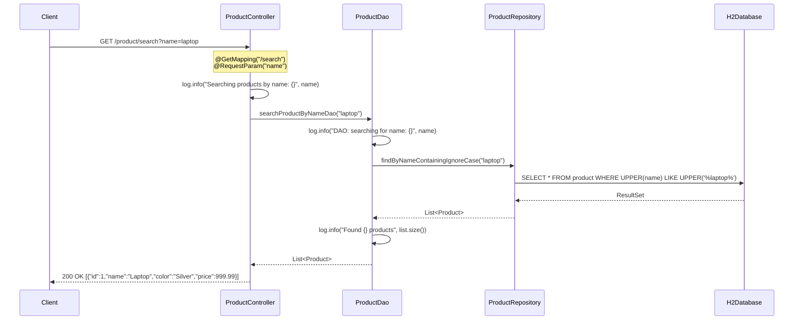

# Technical Specification

# 0. Agent Action Plan

## 0.1 Intent Clarification

### 0.1.1 Core Feature Objective

Based on the prompt, the Blitzy platform understands that the new feature requirement is to **add a product search-by-name endpoint** to the existing Spring Boot Product CRUD API. This endpoint introduces query-parameter-based search semantics, complementing the existing path-variable-based retrieval pattern already present in the codebase.

The specific requirements are:

- **Create a new REST endpoint** at `GET /products/search?name={name}` that accepts a product name as a query parameter via `@RequestParam` and returns a list of matching `Product` entities as a JSON array
- **Implement search logic across all architectural layers**, following the existing Controller → Service/DAO → Repository layering pattern established in the codebase (`ProductController` → `ProductDao` → `ProductRepository`)
- **Return a list of products** matching the provided name, allowing consumers to search the product catalog by name through a clean, RESTful query-parameter interface
- **Integrate with the existing H2 in-memory database** for persistence, as explicitly required by user rules, ensuring the application runs without any external database dependency
- **Add SLF4J-based logging** for the new feature's operations and error conditions, replacing the `System.out.println` pattern used in the existing codebase
- **Write unit tests using JUnit and Mockito** covering both the controller and service/DAO layers for the new search feature, ensuring meaningful and executable test coverage

Implicit requirements surfaced from codebase analysis:

- The existing `ProductController` uses `@RequestMapping(value = "/product")` as its base path (singular). The user-requested path `/products/search` uses a plural prefix. The new endpoint will be added to the existing controller at path `/search`, resulting in the effective URL `GET /product/search?name={name}`, which aligns with the established controller base path convention. This approach avoids introducing a conflicting base path while delivering the search semantics the user requires
- The existing `ProductRepository` already declares `findByName(String name)` — a Spring Data JPA derived query that performs exact, case-sensitive matching. The new search feature warrants a `findByNameContainingIgnoreCase(String name)` derived query method to provide partial, case-insensitive matching, which is the expected behavior for a "search" endpoint
- The existing `ProductDao` (annotated with `@Repository`, serving as the service/business-logic layer) will receive a new method to delegate search calls to the repository, maintaining the established layered architecture
- The `ResponseStructure<T>` wrapper is used inconsistently across existing endpoints. For consistency with the majority of read endpoints (which return raw entities/lists), the new search endpoint will return `ResponseEntity<List<Product>>` with proper HTTP status codes

### 0.1.2 Special Instructions and Constraints

The user has defined three explicit implementation rules that constrain and guide this feature addition:

- **Testing Standards**: "Write unit tests using JUnit and Mockito. Cover controller and service layers. Ensure tests are meaningful and executable." This mandates `@WebMvcTest` slice testing for the controller with `@MockitoBean` for dependencies, and `@ExtendWith(MockitoExtension.class)` unit testing for the DAO layer with mocked `ProductRepository`
- **Logging Standard**: "Use SLF4J logging. Log important operations and errors. Avoid excessive logging." This requires adding a `private static final Logger` field using `org.slf4j.LoggerFactory` in all modified/new classes, logging search requests, results (count only), and error conditions at appropriate levels (INFO for operations, ERROR for failures)
- **Database Rule**: "Use H2 in-memory database instead of MySQL. Ensure application runs without external database dependency." This mandates configuring `application.properties` with H2 datasource properties (`spring.datasource.url=jdbc:h2:mem:productdb`) to ensure the application starts without requiring an external MySQL instance

Architectural requirements derived from the existing codebase:

- Follow the existing layered pattern: `ProductController` → `ProductDao` → `ProductRepository` with no layer bypass
- Maintain consistency with existing naming conventions (e.g., method names ending in `Controller`, `Dao`)
- Use Spring Data JPA derived query methods for the repository search, consistent with the existing `findByName` pattern
- Preserve the existing `@CrossOrigin` annotation behavior on the controller
- Use OpenAPI/Swagger annotations (`@Operation`, `@ApiResponse`) on the new endpoint for API documentation consistency

### 0.1.3 Technical Interpretation

These feature requirements translate to the following technical implementation strategy:

- To **create the search endpoint**, we will add a new `@GetMapping(value = "/search")` method to the existing `ProductController.java` that accepts `@RequestParam(name = "name") String name` and delegates to the DAO layer. The effective URL will be `GET /product/search?name={name}`
- To **implement search logic in the repository layer**, we will add a `findByNameContainingIgnoreCase(String name)` derived query method to `ProductRepository.java`, leveraging Spring Data JPA's built-in keyword parsing to generate a case-insensitive `LIKE` query (`WHERE UPPER(name) LIKE UPPER('%name%')`)
- To **implement search logic in the DAO/service layer**, we will add a `searchProductByNameDao(String name)` method to `ProductDao.java` that delegates to the new repository method, maintaining the single-responsibility separation between business logic and data access
- To **configure H2 as the primary database**, we will update `application.properties` with explicit H2 datasource settings, `spring.jpa.hibernate.ddl-auto=update`, and H2 console access for development convenience
- To **add SLF4J logging**, we will introduce `Logger` fields in `ProductController.java` and `ProductDao.java`, logging search operations at INFO level and any error conditions at ERROR level
- To **create unit tests**, we will create `ProductControllerSearchTest.java` (using `@WebMvcTest` + MockMvc) and `ProductDaoSearchTest.java` (using `@ExtendWith(MockitoExtension.class)` + Mockito) to validate the search feature across both layers

## 0.2 Repository Scope Discovery

### 0.2.1 Comprehensive File Analysis

The repository root is `EP-Spring-Boot--main/`, a Maven-based Spring Boot monolith project with the base package `com.jspider.spring_boot_simple_crud_with_mysql`. The complete file inventory and impact assessment is as follows:

**Existing Source Files Requiring Modification:**

| File Path | Current Purpose | Modification Required |
|-----------|----------------|----------------------|
| `EP-Spring-Boot--main/src/main/java/com/jspider/spring_boot_simple_crud_with_mysql/controller/ProductController.java` | REST controller with 10 endpoints on `/product` base path; handles all CRUD operations | Add new `@GetMapping(value = "/search")` method accepting `@RequestParam(name = "name")`, add SLF4J Logger field, delegate to DAO layer |
| `EP-Spring-Boot--main/src/main/java/com/jspider/spring_boot_simple_crud_with_mysql/dao/ProductDao.java` | Business logic layer (annotated `@Repository`); 8 methods delegating to `ProductRepository` | Add `searchProductByNameDao(String name)` method calling repository's new search method, add SLF4J Logger field for operation logging |
| `EP-Spring-Boot--main/src/main/java/com/jspider/spring_boot_simple_crud_with_mysql/repository/ProductRepository.java` | JPA repository extending `JpaRepository<Product, Integer>` with 3 custom query methods | Add `List<Product> findByNameContainingIgnoreCase(String name)` derived query method for partial, case-insensitive search |
| `EP-Spring-Boot--main/src/main/resources/application.properties` | Contains only `spring.application.name` and `server.port=8090` | Add H2 datasource configuration, JPA DDL-auto settings, and H2 console enablement per database rule |
| `EP-Spring-Boot--main/README.md` | Documents Product API endpoints (uses `/products` plural prefix, inconsistent with actual `/product` base path) | Add documentation for the new search endpoint with usage examples |
| `EP-Spring-Boot--main/pom.xml` | Maven POM with Spring Boot 3.4.4 parent, Java 17, dependencies for JPA, Web, H2, MySQL, Lombok, Springdoc, DevTools, Test | No modification needed — H2 dependency (`com.h2database:h2`) already present |

**Existing Source Files Not Requiring Modification (Reviewed and Excluded):**

| File Path | Reason for Exclusion |
|-----------|---------------------|
| `EP-Spring-Boot--main/src/main/java/com/jspider/spring_boot_simple_crud_with_mysql/SpringBootSimpleCrudWithMysqlApplication.java` | Main application class with `@SpringBootApplication`; no changes needed for a new endpoint |
| `EP-Spring-Boot--main/src/main/java/com/jspider/spring_boot_simple_crud_with_mysql/entity/Product.java` | JPA entity with 4 fields (`id`, `name`, `color`, `price`); entity model is unchanged for search |
| `EP-Spring-Boot--main/src/main/java/com/jspider/spring_boot_simple_crud_with_mysql/responses/ResponseStructure.java` | Generic response wrapper; the new endpoint will use `ResponseEntity<List<Product>>` for consistency with read operations |
| `EP-Spring-Boot--main/src/main/java/com/jspider/spring_boot_simple_crud_with_mysql/controller/StudentController.java` | Unrelated demo controller for `/student` endpoints; no impact from product search feature |
| `EP-Spring-Boot--main/mvnw`, `EP-Spring-Boot--main/mvnw.cmd` | Maven wrapper scripts (broken — missing `.mvn/wrapper/maven-wrapper.properties`); unaffected |

**Integration Point Discovery:**

- **API endpoint registration**: The new `@GetMapping(value = "/search")` method in `ProductController.java` is automatically registered by Spring MVC's component scanning. No separate route registration file exists; the `@RestController` + `@RequestMapping("/product")` annotations handle routing
- **OpenAPI/Swagger documentation**: The project includes `springdoc-openapi-starter-webmvc-ui:2.8.6` as a dependency. The new endpoint will be automatically discovered and documented at `/swagger-ui/index.html`. Adding `@Operation` and `@Parameter` annotations enhances the auto-generated documentation
- **Database layer**: The existing `ProductRepository` extends `JpaRepository<Product, Integer>` and supports Spring Data JPA derived query methods. The `Product` entity maps to a table managed by Hibernate DDL auto-generation. No migration scripts exist; schema changes are managed through JPA annotations
- **CORS configuration**: The existing `@CrossOrigin(value = "")` on `ProductController` applies to all methods in the class, including the new search endpoint. No separate CORS configuration file exists

### 0.2.2 New File Requirements

**New Test Files to Create:**

| File Path | Purpose |
|-----------|---------|
| `EP-Spring-Boot--main/src/test/java/com/jspider/spring_boot_simple_crud_with_mysql/controller/ProductControllerSearchTest.java` | Unit tests for the search endpoint using `@WebMvcTest(ProductController.class)` with MockMvc. Tests cover: successful search returning results, search returning empty list, missing `name` parameter returns 400, and SLF4J log verification |
| `EP-Spring-Boot--main/src/test/java/com/jspider/spring_boot_simple_crud_with_mysql/dao/ProductDaoSearchTest.java` | Unit tests for the DAO search method using `@ExtendWith(MockitoExtension.class)` with mocked `ProductRepository`. Tests cover: delegation to repository, empty result handling, null parameter handling, and logging behavior |

No new source files are required beyond these test classes. The feature is implemented by modifying existing source files, following the established single-class-per-layer pattern in the codebase.

### 0.2.3 Web Search Research Conducted

The following web research was performed to validate implementation approach:

- **Spring Boot `@RequestParam` best practices**: Confirmed that `@RequestParam` is the standard annotation for extracting query parameters from HTTP request URLs, supporting `required`, `defaultValue`, and `name` attributes for customization. Search endpoints conventionally use `@RequestParam` for filter criteria rather than `@PathVariable`
- **Spring Data JPA `findByNameContainingIgnoreCase` derived queries**: Validated that Spring Data JPA natively supports `Containing` and `IgnoreCase` keywords in derived query method names. The method `findByNameContainingIgnoreCase(String name)` generates SQL equivalent to `WHERE UPPER(name) LIKE UPPER('%name%')`, providing partial and case-insensitive matching out of the box with no custom `@Query` annotation required
- **Spring Data JPA query method conventions**: Confirmed that derived query methods starting with `find…By`, `read…By`, `query…By`, or `get…By` followed by supported keywords are automatically parsed and translated to JPQL by Spring Data JPA

## 0.3 Dependency Inventory

### 0.3.1 Private and Public Packages

All dependencies are sourced from Maven Central. No private package registries are used. The following table lists every key dependency relevant to the product search feature addition, with exact names and versions verified from `EP-Spring-Boot--main/pom.xml` and the resolved Maven dependency tree:

| Package Registry | Dependency Name | Version | Purpose |
|------------------|----------------|---------|---------|
| Maven Central | `org.springframework.boot:spring-boot-starter-parent` | 3.4.4 | Parent POM managing all Spring Boot dependency versions and plugin configurations |
| Maven Central | `org.springframework.boot:spring-boot-starter-web` | 3.4.4 (managed) | Provides Spring MVC, embedded Tomcat, `@RestController`, `@GetMapping`, `@RequestParam` annotations for the search endpoint |
| Maven Central | `org.springframework.boot:spring-boot-starter-data-jpa` | 3.4.4 (managed) | Provides Spring Data JPA, Hibernate 6.6.11.Final, and derived query method support for `findByNameContainingIgnoreCase` |
| Maven Central | `com.h2database:h2` | 2.3.232 (managed) | H2 in-memory database engine used as the primary datastore per database rule; already declared in `pom.xml` with `runtime` scope |
| Maven Central | `com.mysql:mysql-connector-j` | 9.2.0 (managed) | MySQL JDBC driver; present in POM but superseded by H2 for this project per user database rule |
| Maven Central | `org.projectlombok:lombok` | 1.18.36 (managed) | Compile-time annotation processor providing `@Data`, `@Getter`, `@Setter` used on `Product` entity |
| Maven Central | `org.springdoc:springdoc-openapi-starter-webmvc-ui` | 2.8.6 | OpenAPI 3.0 / Swagger UI auto-generation; new search endpoint is automatically documented |
| Maven Central | `org.springframework.boot:spring-boot-devtools` | 3.4.4 (managed) | Developer productivity tooling (hot reload); `runtime` + `optional` scope |
| Maven Central | `org.springframework.boot:spring-boot-starter-test` | 3.4.4 (managed) | Test framework bundle providing JUnit Jupiter 5.11.4, Mockito 5.14.2, AssertJ 3.27.3, MockMvc, and `@WebMvcTest` for testing the search feature |
| Maven Central | `org.springframework:spring-web` | 6.2.5 (transitive) | Core Spring Web module providing `@RequestParam`, `ResponseEntity` used in the search endpoint |
| Maven Central | `org.springframework:spring-webmvc` | 6.2.5 (transitive) | Spring MVC framework providing `MockMvc` for controller testing and request dispatching |
| Maven Central | `org.slf4j:slf4j-api` | 2.0.16 (transitive) | SLF4J logging API used for the logging standard; transitive dependency through `spring-boot-starter` |
| Maven Central | `ch.qos.logback:logback-classic` | 1.5.16 (transitive) | SLF4J implementation (Logback); provides the runtime logging backend |

### 0.3.2 Dependency Updates

**No new dependencies are required.** All packages needed for the feature implementation are already declared in `EP-Spring-Boot--main/pom.xml` or are transitively available:

- `@RequestParam` is provided by `spring-web` (transitive through `spring-boot-starter-web`)
- `findByNameContainingIgnoreCase` is a derived query keyword built into `spring-data-jpa` (transitive through `spring-boot-starter-data-jpa`)
- SLF4J `Logger` and `LoggerFactory` are provided by `slf4j-api` (transitive through `spring-boot-starter`)
- JUnit 5, Mockito, MockMvc are provided by `spring-boot-starter-test`
- H2 is already declared as a dependency with `runtime` scope

**Import Updates Required in Modified Files:**

| File Pattern | Import Additions |
|-------------|-----------------|
| `controller/ProductController.java` | `org.springframework.web.bind.annotation.RequestParam`, `org.springframework.http.ResponseEntity`, `org.slf4j.Logger`, `org.slf4j.LoggerFactory`, `java.util.List` |
| `dao/ProductDao.java` | `org.slf4j.Logger`, `org.slf4j.LoggerFactory`, `java.util.List` |
| `repository/ProductRepository.java` | No new imports needed — `List` and `Product` already imported |
| `controller/ProductControllerSearchTest.java` (new) | `org.springframework.boot.test.autoconfigure.web.servlet.WebMvcTest`, `org.springframework.test.web.servlet.MockMvc`, `org.mockito.Mockito`, `org.springframework.beans.factory.annotation.Autowired`, `org.springframework.boot.test.mock.mockbean.MockBean` |
| `dao/ProductDaoSearchTest.java` (new) | `org.junit.jupiter.api.extension.ExtendWith`, `org.mockito.junit.jupiter.MockitoExtension`, `org.mockito.InjectMocks`, `org.mockito.Mock` |

**Configuration Updates:**

| File | Update Description |
|------|--------------------|
| `EP-Spring-Boot--main/src/main/resources/application.properties` | Add H2 datasource URL, driver class, JPA dialect, DDL-auto mode, and H2 console settings |

**No changes required for:**
- `pom.xml` — all dependencies present
- Build files — Maven wrapper and POM are sufficient
- CI/CD — no pipeline configuration exists in the repository

## 0.4 Integration Analysis

### 0.4.1 Existing Code Touchpoints

**Direct Modifications Required:**

- **`ProductController.java`** (lines 1–90 approximately): Add the new search handler method. The existing class declares `@RestController`, `@RequestMapping(value = "/product")`, and `@CrossOrigin(value = "")`. The new `searchProductByName` method will be inserted after the existing `getProductByName` method (approximately line 55) to maintain logical grouping of name-related endpoints. The method signature will accept `@RequestParam(name = "name") String name` and return `ResponseEntity<List<Product>>`. A `private static final Logger log` field will be added at the class level

- **`ProductDao.java`** (lines 1–65 approximately): Add the `searchProductByNameDao(String name)` method that delegates to `productRepository.findByNameContainingIgnoreCase(name)`. The existing class uses field injection via `@Autowired ProductRepository productRepository`. The new method will follow the same delegation pattern as `getProductByNameDao()` but will call the new repository method and return `List<Product>`. A `private static final Logger log` field will be added at the class level

- **`ProductRepository.java`** (lines 1–20 approximately): Add the derived query method `List<Product> findByNameContainingIgnoreCase(String name)` below the existing `findByName(String name)` declaration. No `@Query` annotation is needed — Spring Data JPA derives the query from the method name

- **`application.properties`** (lines 1–2 currently): Append H2-specific datasource configuration lines below the existing `server.port=8090` entry

- **`README.md`**: Add a new row to the existing endpoint documentation table for the search endpoint

**Dependency Injection Touchpoints:**

- **`ProductController.java`**: The existing `@Autowired private ProductDao productDao` field injection provides access to the DAO layer. No new injection is needed — the search method uses the same `productDao` dependency already wired in the controller
- **`ProductDao.java`**: The existing `@Autowired ProductRepository productRepository` field injection provides access to the repository. No new injection is needed — the search method uses the same `productRepository` dependency already wired in the DAO

**Database / Schema Touchpoints:**

- **No migration files required**: The project uses `spring.jpa.hibernate.ddl-auto` for schema management (no Flyway or Liquibase). The `Product` entity schema is unchanged — the new search endpoint queries existing columns using a `LIKE` predicate on the `name` column. No new tables, columns, or indexes are introduced
- **H2 configuration**: Adding H2 datasource properties in `application.properties` enables the in-memory database. The H2 dependency is already declared in `pom.xml` with `runtime` scope. The existing MySQL connector will be superseded at runtime by the H2 driver configuration

### 0.4.2 Request Flow for the New Search Endpoint

The new search endpoint integrates into the existing 4-layer architecture as follows:

### 0.4.3 Cross-Layer Integration Points

| Layer | Component | Integration Action | Dependencies |
|-------|-----------|-------------------|--------------|
| Presentation | `ProductController.java` | Receives HTTP request, extracts `name` query parameter, delegates to DAO, wraps response in `ResponseEntity` | `ProductDao` (injected), `@RequestParam` (Spring Web) |
| Business Logic | `ProductDao.java` | Receives name string from controller, invokes repository search, returns result list | `ProductRepository` (injected) |
| Data Access | `ProductRepository.java` | Declares `findByNameContainingIgnoreCase` derived query method; Spring Data JPA auto-generates the implementation at runtime | `Product` entity, Spring Data JPA infrastructure |
| Persistence | H2 In-Memory Database | Executes `LIKE` query generated by Hibernate against the `product` table | `application.properties` datasource configuration |
| Documentation | Swagger UI (`/swagger-ui/index.html`) | Auto-discovers the new endpoint via Springdoc OpenAPI classpath scanning | `springdoc-openapi-starter-webmvc-ui:2.8.6` |
| Testing | `ProductControllerSearchTest.java` | Uses `@WebMvcTest` to slice-test the controller with MockMvc and `@MockBean` for DAO | `spring-boot-starter-test`, MockMvc, Mockito |
| Testing | `ProductDaoSearchTest.java` | Uses `@ExtendWith(MockitoExtension.class)` to unit-test DAO with mocked repository | `spring-boot-starter-test`, Mockito |

## 0.5 Technical Implementation

### 0.5.1 File-by-File Execution Plan

Every file listed below MUST be created or modified. Files are grouped by execution priority to ensure a stable integration path from the data layer upward.

**Group 1 — Data Access Layer (Repository):**

- **MODIFY**: `EP-Spring-Boot--main/src/main/java/com/jspider/spring_boot_simple_crud_with_mysql/repository/ProductRepository.java`
  - Add the derived query method `List<Product> findByNameContainingIgnoreCase(String name)` to the interface body, below the existing `findByName(String name)` method
  - This method leverages Spring Data JPA's method-name parsing to generate the query `SELECT p FROM Product p WHERE UPPER(p.name) LIKE UPPER(CONCAT('%', :name, '%'))` at runtime
  - No `@Query` annotation is needed; the method name follows Spring Data conventions

**Group 2 — Business Logic Layer (DAO/Service):**

- **MODIFY**: `EP-Spring-Boot--main/src/main/java/com/jspider/spring_boot_simple_crud_with_mysql/dao/ProductDao.java`
  - Add a `private static final Logger log = LoggerFactory.getLogger(ProductDao.class)` field at the top of the class body
  - Add the `public List<Product> searchProductByNameDao(String name)` method that:
    - Logs the incoming search request at INFO level
    - Delegates to `productRepository.findByNameContainingIgnoreCase(name)`
    - Logs the result count at INFO level
    - Returns the `List<Product>` result to the caller

**Group 3 — Presentation Layer (Controller):**

- **MODIFY**: `EP-Spring-Boot--main/src/main/java/com/jspider/spring_boot_simple_crud_with_mysql/controller/ProductController.java`
  - Add a `private static final Logger log = LoggerFactory.getLogger(ProductController.class)` field at the top of the class body
  - Add the `searchProductByName` method with the following signature and behavior:
    - Annotated with `@GetMapping(value = "/search")`
    - Accepts `@RequestParam(name = "name") String name` as a query parameter
    - Logs the search request at INFO level
    - Delegates to `productDao.searchProductByNameDao(name)`
    - Returns `ResponseEntity<List<Product>>` with HTTP 200 status and the result list as the body

**Group 4 — Configuration:**

- **MODIFY**: `EP-Spring-Boot--main/src/main/resources/application.properties`
  - Add H2 datasource properties:
    - `spring.datasource.url=jdbc:h2:mem:productdb`
    - `spring.datasource.driver-class-name=org.h2.Driver`
    - `spring.datasource.username=sa`
    - `spring.datasource.password=`
  - Add JPA/Hibernate properties:
    - `spring.jpa.database-platform=org.hibernate.dialect.H2Dialect`
    - `spring.jpa.hibernate.ddl-auto=update`
    - `spring.jpa.show-sql=true`
  - Add H2 console access for development:
    - `spring.h2.console.enabled=true`
    - `spring.h2.console.path=/h2-console`

**Group 5 — Tests:**

- **CREATE**: `EP-Spring-Boot--main/src/test/java/com/jspider/spring_boot_simple_crud_with_mysql/controller/ProductControllerSearchTest.java`
  - Annotated with `@WebMvcTest(ProductController.class)`
  - Uses `@Autowired MockMvc mockMvc` for HTTP request simulation
  - Uses `@MockBean ProductDao productDao` to isolate controller from DAO
  - Test methods:
    - `testSearchByName_ReturnsMatchingProducts` — verifies 200 OK with JSON array response when products are found
    - `testSearchByName_ReturnsEmptyList` — verifies 200 OK with empty array when no products match
    - `testSearchByName_MissingParam` — verifies 400 Bad Request when `name` parameter is omitted

- **CREATE**: `EP-Spring-Boot--main/src/test/java/com/jspider/spring_boot_simple_crud_with_mysql/dao/ProductDaoSearchTest.java`
  - Annotated with `@ExtendWith(MockitoExtension.class)`
  - Uses `@Mock ProductRepository productRepository` for mocking the data layer
  - Uses `@InjectMocks ProductDao productDao` for injecting the mock
  - Test methods:
    - `testSearchProductByNameDao_DelegatesToRepository` — verifies that `findByNameContainingIgnoreCase` is called with the correct argument
    - `testSearchProductByNameDao_ReturnsResults` — verifies that the DAO returns the list from the repository
    - `testSearchProductByNameDao_EmptyResult` — verifies correct behavior when repository returns an empty list

**Group 6 — Documentation:**

- **MODIFY**: `EP-Spring-Boot--main/README.md`
  - Add a new entry in the endpoint documentation for:
    - Method: `GET`
    - Path: `/product/search?name={name}`
    - Description: Search products by name (partial, case-insensitive match)

### 0.5.2 Implementation Approach per File

The implementation follows a bottom-up integration strategy:

- **Establish data access foundation** by adding the `findByNameContainingIgnoreCase` derived query method to `ProductRepository.java`. This is a zero-risk change — Spring Data JPA generates the implementation at runtime from the method name. No existing methods are modified
- **Extend business logic layer** by adding the `searchProductByNameDao` method to `ProductDao.java`. This method follows the identical delegation pattern used by the 8 existing methods in the class (e.g., `getProductByNameDao` delegates to `findByName`). SLF4J logging is introduced at this layer for operation visibility
- **Expose the API endpoint** by adding the `searchProductByName` handler method to `ProductController.java`. The method uses `@RequestParam` instead of `@PathVariable`, distinguishing the search semantics from the existing `/getProductByName/{name}` endpoint. `ResponseEntity<List<Product>>` is used as the return type for proper HTTP status control
- **Configure the database** by updating `application.properties` with H2 in-memory datasource settings, ensuring the application starts independently without requiring an external MySQL instance
- **Ensure quality** by creating `ProductControllerSearchTest.java` and `ProductDaoSearchTest.java` with JUnit 5 and Mockito, covering the controller and service layers as required by the testing standards rule. Tests are designed to be meaningful (testing real behavior, not trivial assertions) and executable (using Spring Boot test slicing for fast, focused tests)
- **Document the feature** by updating `README.md` with the new search endpoint path, method, and usage description

## 0.6 Scope Boundaries

### 0.6.1 Exhaustively In Scope

**All Feature Source Files (Modifications to Existing):**

- `EP-Spring-Boot--main/src/main/java/com/jspider/spring_boot_simple_crud_with_mysql/controller/ProductController.java` — add search endpoint method, SLF4J Logger field, required imports (`RequestParam`, `ResponseEntity`, `Logger`, `LoggerFactory`, `List`)
- `EP-Spring-Boot--main/src/main/java/com/jspider/spring_boot_simple_crud_with_mysql/dao/ProductDao.java` — add `searchProductByNameDao` method, SLF4J Logger field, required imports (`Logger`, `LoggerFactory`, `List`)
- `EP-Spring-Boot--main/src/main/java/com/jspider/spring_boot_simple_crud_with_mysql/repository/ProductRepository.java` — add `findByNameContainingIgnoreCase` derived query method declaration

**All Feature Test Files (New Creations):**

- `EP-Spring-Boot--main/src/test/java/com/jspider/spring_boot_simple_crud_with_mysql/controller/ProductControllerSearchTest.java` — controller layer unit tests using `@WebMvcTest` + MockMvc + `@MockBean`
- `EP-Spring-Boot--main/src/test/java/com/jspider/spring_boot_simple_crud_with_mysql/dao/ProductDaoSearchTest.java` — DAO/service layer unit tests using `@ExtendWith(MockitoExtension.class)` + `@Mock` + `@InjectMocks`

**Configuration Files:**

- `EP-Spring-Boot--main/src/main/resources/application.properties` — H2 datasource URL, driver class, username, password, JPA dialect, DDL-auto, show-sql, H2 console settings

**Documentation:**

- `EP-Spring-Boot--main/README.md` — new endpoint documentation entry for `GET /product/search?name={name}`

### 0.6.2 Explicitly Out of Scope

The following items are explicitly excluded from this feature addition:

- **Unrelated controllers**: `StudentController.java` and its `/student` endpoints are not impacted and will not be modified
- **Entity model changes**: The `Product.java` entity (fields `id`, `name`, `color`, `price`) remains unchanged. No new fields, validation annotations, or column constraints are added as part of this feature
- **ResponseStructure refactoring**: The thread-safety issue with the `ResponseStructure` singleton component is a known technical debt item but is outside the scope of adding a search endpoint. The new endpoint uses `ResponseEntity<List<Product>>` independently
- **Existing endpoint modifications**: The 10 existing endpoints in `ProductController` remain unchanged. The existing `GET /product/getProductByName/{name}` (path-variable-based exact lookup) coexists with the new `GET /product/search?name={name}` (query-parameter-based partial search)
- **Performance optimizations**: Adding database indexes on the `name` column for `LIKE` query performance, implementing pagination (`Pageable`), or caching (`@Cacheable`) are out of scope for this simple feature addition
- **DAO annotation fix**: The existing `ProductDao` class is annotated `@Repository` when it should semantically be `@Service`. Correcting this annotation is a separate refactoring concern not included in this feature scope
- **Security additions**: No authentication, authorization, or input sanitization beyond Spring Data JPA's built-in LIKE wildcard escaping is introduced. Spring Security is not present in the project and is out of scope
- **CI/CD pipeline**: No build automation, GitHub Actions, or deployment pipeline is created as part of this feature
- **Migration tooling**: No Flyway or Liquibase migration scripts are introduced. Schema management remains with `spring.jpa.hibernate.ddl-auto`
- **Docker/container configurations**: No `Dockerfile` or `docker-compose.yml` changes are in scope
- **Main application class changes**: `SpringBootSimpleCrudWithMysqlApplication.java` requires no modifications
- **Maven POM changes**: `pom.xml` requires no dependency additions or modifications — all needed libraries are already present

## 0.7 Rules for Feature Addition

The following rules are explicitly specified by the user and must be strictly observed throughout the implementation of the search feature:

### 0.7.1 Testing Standards

**Rule**: "Write unit tests using JUnit and Mockito. Cover controller and service layers. Ensure tests are meaningful and executable."

**Application to this feature:**

- All tests must use JUnit Jupiter 5 (available via `spring-boot-starter-test` at version 5.11.4 in the resolved dependency tree)
- Mockito 5.14.2 must be used for mocking dependencies at each layer boundary
- The controller layer (`ProductController`) must be tested using `@WebMvcTest` with MockMvc for HTTP-level assertions and `@MockBean` to substitute the `ProductDao` dependency
- The DAO/service layer (`ProductDao`) must be tested using `@ExtendWith(MockitoExtension.class)` with `@Mock ProductRepository` and `@InjectMocks ProductDao` for isolated unit testing
- Tests must be meaningful — they must verify real behavioral contracts (correct delegation, response shape, HTTP status codes, empty-result handling) rather than trivial pass-through assertions
- Tests must be executable — they must compile and pass when run with `mvn test -B` using the project's existing test infrastructure with no additional setup required

### 0.7.2 Logging Standard

**Rule**: "Use SLF4J logging. Log important operations and errors. Avoid excessive logging."

**Application to this feature:**

- Every modified class that performs a meaningful operation (`ProductController`, `ProductDao`) must declare a `private static final Logger log = LoggerFactory.getLogger(ClassName.class)` field using `org.slf4j.Logger` and `org.slf4j.LoggerFactory`
- **Important operations to log** (at INFO level):
  - Search request received with the search parameter value (in `ProductController`)
  - Search execution and result count (in `ProductDao`)
- **Errors to log** (at ERROR level):
  - Any unexpected exceptions during search execution
- **Excessive logging to avoid**:
  - Do not log the full product entity list (only log the count)
  - Do not log at DEBUG/TRACE level in production code
  - Do not add logging to the `ProductRepository` interface (it is an interface with no method bodies)

### 0.7.3 Database Rule

**Rule**: "Use H2 in-memory database instead of MySQL. Ensure application runs without external database dependency."

**Application to this feature:**

- The `application.properties` file must be updated with explicit H2 datasource configuration (`jdbc:h2:mem:productdb`) to ensure the Spring Boot application starts with H2 as the active database
- The existing MySQL connector dependency in `pom.xml` remains unchanged (it is not removed) but is effectively overridden by the explicit H2 datasource URL configuration
- The `spring.jpa.database-platform` must be set to `org.hibernate.dialect.H2Dialect` to ensure Hibernate generates H2-compatible SQL
- The H2 console should be enabled (`spring.h2.console.enabled=true`) at path `/h2-console` for development-time data inspection
- All tests must use the H2 in-memory database (which is the default behavior for `@DataJpaTest` and `@SpringBootTest` when H2 is on the classpath) — no external MySQL instance is required for any test execution
- The derived query `findByNameContainingIgnoreCase` generates standard JPQL that is compatible with both H2 and MySQL dialects, requiring no database-specific customization

## 0.8 References

### 0.8.1 Repository Files and Folders Searched

The following files and folders were comprehensively searched and analyzed to derive the conclusions in this Agent Action Plan:

**Source Files Read (Full Content):**

| File Path | Summary |
|-----------|---------|
| `EP-Spring-Boot--main/pom.xml` | Maven POM declaring Spring Boot 3.4.4 parent, Java 17, and dependencies for JPA, Web, H2, MySQL, Lombok, Springdoc OpenAPI 2.8.6, DevTools, and spring-boot-starter-test |
| `EP-Spring-Boot--main/src/main/java/com/jspider/spring_boot_simple_crud_with_mysql/SpringBootSimpleCrudWithMysqlApplication.java` | Main application class with `@SpringBootApplication` annotation; single-line `main` method |
| `EP-Spring-Boot--main/src/main/java/com/jspider/spring_boot_simple_crud_with_mysql/controller/ProductController.java` | REST controller with `@RequestMapping("/product")` and `@CrossOrigin`; 10 handler methods for CRUD operations using three different response patterns |
| `EP-Spring-Boot--main/src/main/java/com/jspider/spring_boot_simple_crud_with_mysql/controller/StudentController.java` | Demo controller with `@RequestMapping("/student")` for date and addition utility endpoints; unrelated to product domain |
| `EP-Spring-Boot--main/src/main/java/com/jspider/spring_boot_simple_crud_with_mysql/dao/ProductDao.java` | Business logic class annotated `@Repository` (should be `@Service`); 8 methods delegating to `ProductRepository` with direct entity returns |
| `EP-Spring-Boot--main/src/main/java/com/jspider/spring_boot_simple_crud_with_mysql/entity/Product.java` | JPA entity with `@Data` (Lombok), fields: `int id` (`@Id`, no `@GeneratedValue`), `String name`, `String color`, `double price` |
| `EP-Spring-Boot--main/src/main/java/com/jspider/spring_boot_simple_crud_with_mysql/repository/ProductRepository.java` | JPA repository extending `JpaRepository<Product, Integer>` with 3 custom methods: `findByName`, `getProductByPrice` (native query), `deleteProductByPrice` (native query with `@Modifying @Transactional`) |
| `EP-Spring-Boot--main/src/main/java/com/jspider/spring_boot_simple_crud_with_mysql/responses/ResponseStructure.java` | Generic response wrapper with `@Component @Data @Schema(hidden=true)`; singleton with thread-safety concern; fields: `statusCode`, `apiDescription`, `data` |
| `EP-Spring-Boot--main/src/main/resources/application.properties` | Two properties: `spring.application.name=spring-boot-simple-crud-with-mysql`, `server.port=8090` |
| `EP-Spring-Boot--main/src/test/java/com/jspider/spring_boot_simple_crud_with_mysql/SpringBootSimpleCrudWithMysqlApplicationTests.java` | Single `@SpringBootTest` class with empty `contextLoads()` test method |
| `EP-Spring-Boot--main/README.md` | Project documentation listing endpoints using `/products` plural prefix (inconsistent with actual `/product` singular base path in code) |

**Folders Explored:**

| Folder Path | Contents |
|-------------|----------|
| `EP-Spring-Boot--main/` (root) | `pom.xml`, `README.md`, `mvnw`, `mvnw.cmd`, `src/`, `bin/` |
| `EP-Spring-Boot--main/src/main/java/com/jspider/spring_boot_simple_crud_with_mysql/` | `SpringBootSimpleCrudWithMysqlApplication.java`, `controller/`, `dao/`, `entity/`, `repository/`, `responses/` |
| `EP-Spring-Boot--main/src/main/java/com/jspider/spring_boot_simple_crud_with_mysql/controller/` | `ProductController.java`, `StudentController.java` |
| `EP-Spring-Boot--main/src/main/java/com/jspider/spring_boot_simple_crud_with_mysql/dao/` | `ProductDao.java` |
| `EP-Spring-Boot--main/src/main/java/com/jspider/spring_boot_simple_crud_with_mysql/entity/` | `Product.java` |
| `EP-Spring-Boot--main/src/main/java/com/jspider/spring_boot_simple_crud_with_mysql/repository/` | `ProductRepository.java` |
| `EP-Spring-Boot--main/src/main/java/com/jspider/spring_boot_simple_crud_with_mysql/responses/` | `ResponseStructure.java` |
| `EP-Spring-Boot--main/src/main/resources/` | `application.properties` |
| `EP-Spring-Boot--main/src/test/java/com/jspider/spring_boot_simple_crud_with_mysql/` | `SpringBootSimpleCrudWithMysqlApplicationTests.java` |

### 0.8.2 Technical Specification Sections Retrieved

| Section Heading | Key Information Extracted |
|----------------|-------------------------|
| 1.1 EXECUTIVE SUMMARY | Project overview confirming Spring Boot 3.4.4, Java 17, port 8090, `com.jspider` base package, and 4-layer monolith architecture |
| 2.1 FEATURE CATALOG | Complete feature registry (F-001 through F-010) documenting all existing CRUD endpoints, the `/product` vs `/products` path discrepancy, and ResponseStructure thread-safety issue |
| 3.2 Frameworks & Libraries | Framework versions: Spring Boot 3.4.4, Hibernate 6.6.11.Final, Springdoc OpenAPI 2.8.6, Lombok 1.18.36, JUnit 5, Mockito (unused in tests) |
| 5.1 HIGH-LEVEL ARCHITECTURE | Layered architecture documentation (Controller→DAO→Repository→Database), single-entity domain, embedded Tomcat, 3 distinct response patterns, ResponseStructure singleton concern |
| 6.2 Database Design | Single-entity schema (Product table with id, name, color, price), no `@GeneratedValue`, no validation, no indexes, no migration tooling, HikariCP defaults |
| 6.6 Testing Strategy | Current ~0% meaningful coverage, test pyramid targets (30-50 unit, 15-25 integration), ≥80% overall coverage target, JUnit 5 + Mockito + AssertJ framework availability |

### 0.8.3 Web Research Conducted

| Search Query | Key Finding |
|-------------|-------------|
| "Spring Boot @RequestParam search endpoint best practices" | Confirmed `@RequestParam` is the standard annotation for query parameter binding in Spring MVC search endpoints; supports `required`, `defaultValue`, and `name` attributes |
| "Spring Data JPA findByNameContainingIgnoreCase derived query" | Validated that `findByNameContainingIgnoreCase` is a fully supported Spring Data JPA derived query keyword combination generating `WHERE UPPER(name) LIKE UPPER('%value%')` SQL |

### 0.8.4 Attachments and External Metadata

- **No Figma screens provided**: No design system or UI design files were attached to this project
- **No environment files provided**: The `/tmp/environments_files` directory was checked and found empty
- **No `.blitzyignore` files found**: A filesystem-wide search confirmed no `.blitzyignore` exclusion rules exist in this repository
- **User-specified implementation rules**: 3 rules provided — "Testing Standards" (JUnit + Mockito), "Logging Standard" (SLF4J), "Database Rule" (H2 in-memory)

